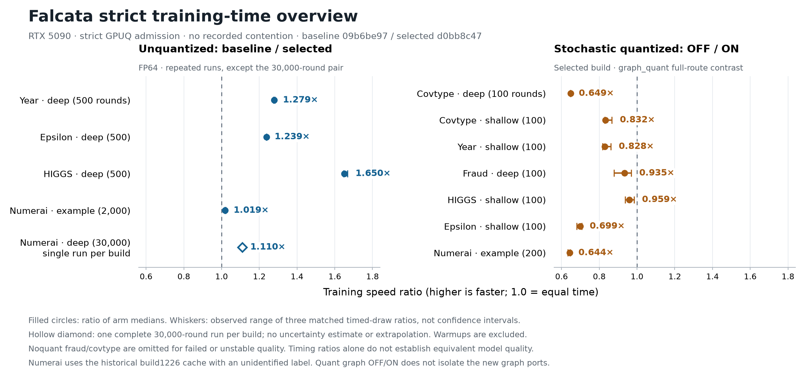

# Falcata affected overnight timings — 2026-10-09

All affected Falcata experiments finished overnight. The 35 strict GPUQ jobs ended as **33 done, two
failed, zero pending**, with **zero recorded contention**. The failures are preserved fraud model-sanity
and final-curve agreement failures; they are not replaced or included in speed claims. FP64 remains the
default and FP32 remains explicit. This dated verdict and its evidence are immutable.

## Coverage and measured artifacts

The affected main reproduction has **66/66 records** over fourteen default noquant groups: six numeric
datasets (fraud, covtype, year, higgs, epsilon, airline) each shallow/deep, Numerai example, and the full
30,000-round Numerai-deep workload. It retains 61 ok, four insane, and one bad-curve endpoint. All thirteen
curves were captured; eleven passed and are plotted, while both fraud curves remain in the evidence.

The original paired series has **90/90 records** (68 timed, 22 discarded warmups), comprising six
noquant baseline/selected pairs, two stochastic controls, both full deep builds, and three graph-key
ablations. The affected main matrix reuses 25 matching selected records and adds 41 fresh records.
Auxiliary coverage is **65/65 endpoints**, all passing: seven historical quantized graph ON/OFF cases
(56 records), six ingestion draws, and three affected nightly performance cases. Across the overlapping
instruments there are **196 unique planned endpoint records**, all retained. No seeds or failed draws
were replaced and no competing engine was rerun.

The selected runtime is `d0bb8c47789e062acbf6b770918a0589a74ae9b2`, installed library SHA256
`e67a7ad314a75cec7414ecdcfaa05895040191f50c86c960c432bce919d0a90c`. The reference is
`09b6be9724f330f947c86de6e819654b077f70f2`, SHA256
`cb6de00388a1d85e32c8a8d1144310777d73767e1e56a8b32ab810e47d636e08`. Both measured artifacts
resolve to FP64 without precision overrides. Later branch changes are documentation only. The older
candidate path in some submitted argv arrays is resolved by the dispatcher; actual per-record runtime
and loaded-library hashes establish the measured artifact, rather than that queued path.

Jobs run serially on the RTX 5090 through strict GPUQ admission; logs record a dark desktop and the
queue records no contention. Timed diagnostics are disabled, and discarded warmups establish graph
capture where required. The cache, configs, dtype, 32 threads and seed 42 are fixed reproductions.
[Pinned main manifest](2026-10-09_noquant-timings/manifest-v2.txt), SHA256
`9a3be069eee56031baa9dd1c17a58b039099057dbc043c868db2b9a074631e3c`, and
[pinned graph manifest](2026-10-09_noquant-timings/graph-quant-manifest.txt), SHA256
`40e6e6205aa2b3c0e35367bdba788edca8cf5304a22c66d9e258b52ebe1387f5`, retain exact bytes.

## Quiet before/after measurements

Training seconds are medians of three interleaved timed draws per arm after discarded warmups, except
the explicitly labelled full deep runs. A baseline/selected ratio above one means selected training is
faster. The percentage is the reduction in elapsed training time. Complete sanity-passing draws and
uncontended strict execution establish timing eligibility; passing a coarse sanity threshold does not
establish equivalent quality. Covtype and fraud remain unstable and are not the basis of an equivalence
or quality-improvement claim.

| Workload | Baseline seconds | Selected seconds | Baseline/selected | Less time | Quality/limit |
|---|---:|---:|---:|---:|---|
| year-noquant | 3.50122 | 2.73836 | 1.2786× | 21.8% | RMSE ranges overlap |
| epsilon-noquant | 57.7655 | 46.6361 | 1.2386× | 19.3% | AUC ranges overlap |
| higgs-noquant | 15.9336 | 9.65527 | 1.6502× | 39.4% | Median AUC about 0.848640; one lower candidate draw |
| covtype-noquant | 5.31367 | 4.21961 | 1.2593× | 20.6% | Variable accuracy/log loss; no equivalence claim |
| fraud-noquant | 0.606037 | 0.453849 | 1.3353× | 25.1% | Variable AUC; no equivalence claim |
| numerai-noquant | 54.8088 | 53.8071 | 1.0186× | 1.8% | Recorded CORR 0.0193116 in both arms |
| epsilon-stoch | 11.2253 | 11.2201 | 1.0005× | 0.0% | Stochastic control; recorded AUC unchanged |
| numerai-stoch | 5.63179 | 5.61594 | 1.0028× | 0.3% | Stochastic control; recorded CORR unchanged |
| Numerai deep, full 30,000 rounds, one run per arm | 1372.53 | 1236.51 | 1.1100× | 9.9% | CORR 0.0238562 → 0.0238004; single-run evidence |

The stable Year/Epsilon ranges overlap, while Higgs includes one lower candidate AUC draw. The full
deep result is **22.88 → 20.61 minutes**, a 9.9% reduction from one complete run per build, with a small
recorded CORR difference. It is not an extrapolation or a repeatability/quality-equivalence proof.
Numerai example saves about 1.8%; stochastic controls are essentially unchanged. The earlier
[correctness and fresh-seed quality verdict](2026-10-09_noquant-validation.md) remains the evidence for
quality limitations; quiet timing does not invalidate its retained failures or prove a cost-free tradeoff.

## Graph ports and explicit quantized graph mode

Independent same-build key ablations on Numerai example measure `graph_apply_rows` at 53.7878 seconds
ON versus 54.8055 OFF (1.0189× OFF/ON). `graph_apply_fused` is effectively unchanged at 53.7921 seconds
in either arm. `graph_skip_unsplittable` is 21.3436 ON versus 22.9577 OFF (1.0756×) on the declared
500-round Numerai-deep probe. That bounded probe is not a 30,000-round estimate. These bit-preserving
ports retain the separate correctness/lifecycle coverage already recorded in the earlier verdict.

Forced `graph_quant:on` is slower than OFF in **all seven** historical cases: OFF/ON is 0.6441–0.9592×.
Timed model and prediction fingerprints match across all six draws in each case; warmups observe ON
capture. This contrasts the complete graph route against the host route inside the selected build and
does not isolate the new ports or establish a before/after regression. Quantized graph mode remains
explicit opt-in. Exact parameters and quality endpoints are in the auxiliary report.

## Failures, resource probes and scope limits

Fraud/shallow retains four sanity failures at AUC near 0.50 (warmup, timed1, timed2, curve) and one
passing timed draw at 0.753406. It has no complete timing headline. Fraud/deep retains a rejected curve:
the final built-in AUC 0.664695 disagrees with predict()-based AUC 0.585629. Its separate three timed
draws passed, but that does not repair the curve or establish stable quality. These categories already
occurred in the October 8 benchmark; prior occurrence does not identify a cause or establish equivalent
behavior. Both curves are excluded from plots and every finite failed metric remains in the sidecars.

Native ingestion uses the original unquantized first-five-tree recipe, three fresh processes per dtype.
Float32/int8 medians are construct 31.34/3.89 seconds, create 1.34/0.76 seconds, first five trees
0.17/0.16 seconds, and peak RSS 64.9/32.3 GiB. First-five-tree hashes vary between draws. These are
absolute observations without held-out quality or a before/after claim. Historical grouped construction
and RSS results are confounded by Dataset reuse and float32 versus int8 input differences.

All three affected nightly throughput cases pass their unchanged adaptive-repeat protocol: covtype
shallow nonquant 0.454 seconds training, explicit-FP32 Year shallow 0.1273 seconds, explicit-FP32
Numerai nonquant 3.2002 seconds. These cases have no holdout evaluation or equivalence conclusion.

Fixed-only L2 sweeps, stochastic-only data-view sweeps, categorical and vector routes, Numerai leaf,
inference, standalone quantized histogram/occupancy probes and other engines were outside the affected
scope. No dataset refresh or configuration selection took place. Candidate-only shallow/airline reruns
complete the affected matrix but do not themselves establish a before/after benefit.

Numerai inputs are pinned int8; the historical build1226 cached label is unidentified. CORR endpoints
come from `NumeraiEvaluator(cpu)`, while Numerai's learning curve uses native mean squared error (l2).
This is fixed-cache implementation evidence, not current-target selection, prequential selection or a
production release. Curve elapsed time includes scheduled evaluation, so it differs from pure timed
training; binary curves use AUC, covtype uses multiclass log loss and regression uses mean squared error.

## Detailed evidence and reproduction

- [Paired timings, graph-key ablations, quality ranges and raw provenance](2026-10-09_noquant-timings/strict-timing-report.md)
  with [90-record sidecar](2026-10-09_noquant-timings/strict-timing-evidence.json).
- [All fourteen affected groups and eleven accepted learning curves](2026-10-09_noquant-timings/affected-timing-report.md)
  with [66-record sidecar](2026-10-09_noquant-timings/affected-timing-evidence.json).
- [Seven quantized graph pairs, ingestion and nightly cases](2026-10-09_noquant-timings/auxiliary-timing-report.md)
  with [65-endpoint sidecar](2026-10-09_noquant-timings/auxiliary-timing-evidence.json).
- [CPU report audit](2026-10-09_noquant-timings/report-audit.json), [overview source](2026-10-09_noquant-timings/plots/plot_timing_overview.py)
  and [vector overview](2026-10-09_noquant-timings/plots/overview.svg).

The sidecars retain actual invocation arguments, configs, source/helper/library identities, seed, cache
and dtype, original statuses and queue state. Original timing order is baseline warmup, selected warmup,
baseline1, selected1, selected2, baseline2, baseline3, selected3; historical graph pairs use OFF warmup,
ON warmup, OFF1, ON1, ON2, OFF2, OFF3, ON3. Existing native benchmark and ablation recipes are reused.
The existing [benchmark instructions](../benchmarks/README.md) describe the instruments; fixed artifacts,
caches and full per-endpoint parameters in the sidecars identify this reproduction. No failed endpoint
should be silently retried as part of this evidence. Documentation/static verification accompanies the
archive; completed runtime correctness/quality tests were not rerun for documentation-only changes.

Archive checks passed for all 35 terminal strict jobs, complete endpoint coverage, exact frozen manifest
bytes, semantically unchanged evidence JSON, all eleven learning-curve hashes and 49 local report links.
All ten applicable pinned pre-commit checks passed: XML, file endings, trailing whitespace, OpenMP
pragmas, parameter regeneration, Ruff check/format, Biome, typos and mypy. The remaining hooks had no
applicable files. [Static-check output](2026-10-09_noquant-timings/static-checks.txt) preserves the result.
