Affected Falcata benchmark reproduction — 2026-10-09

Frozen scope: fourteen noquant groups, 66 planned records; 66 records retained and 0 settled cells without raw endpoints.
Selected runtime d0bb8c47789e062acbf6b770918a0589a74ae9b2 uses its unoverridden FP64 default.
Every finite endpoint and every failure is retained in [affected-timing-evidence.json](affected-timing-evidence.json).
Recorded kinds: {"warmup": 13, "timed1": 14, "timed2": 13, "timed3": 13, "curve": 13}; statuses: {"insane": 4, "ok": 61, "bad_curve": 1}.
The original interleaved baseline/candidate comparisons and graph-key ablations are reported separately in [strict-timing-report.md](strict-timing-report.md).

Training times show median [minimum, maximum] seconds from three short timed runs, or one full Numerai-deep run.
Headline eligibility requires every planned timed model to pass sanity and actual strict jobs to finish without recorded contention.
Quality ranges retain failed models. Candidate-only reruns do not establish a before/after improvement.

| Group | Training seconds | Sane timed / planned | Quiet headline eligible | Failures, all kinds |
|---|---:|---:|---|---|
| fraud-shallow | 0.481655 [0.481655, 0.481655] | 1/3 | False | {"insane": 4} |
| fraud-deep | 0.453849 [0.442745, 0.538669] | 3/3 | True | {"bad_curve": 1} |
| covtype-shallow | 2.42721 [2.41796, 2.48028] | 3/3 | True | {} |
| covtype-deep | 4.21961 [4.18245, 4.27304] | 3/3 | True | {} |
| year-shallow | 0.767331 [0.76679, 0.772306] | 3/3 | True | {} |
| year-deep | 2.73836 [2.73204, 2.74384] | 3/3 | True | {} |
| higgs-shallow | 3.15785 [3.14497, 3.16136] | 3/3 | True | {} |
| higgs-deep | 9.65527 [9.5558, 9.6729] | 3/3 | True | {} |
| epsilon-shallow | 8.02151 [8.01927, 8.02902] | 3/3 | True | {} |
| epsilon-deep | 46.6361 [46.6053, 46.6669] | 3/3 | True | {} |
| airline-shallow | 19.9713 [19.962, 19.9736] | 3/3 | True | {} |
| airline-deep | 64.584 [64.5196, 64.7713] | 3/3 | True | {} |
| numerai-numerai | 53.8071 [53.7586, 53.8219] | 3/3 | True | {} |
| numerai-numerai-deep | 1236.51 [1236.51, 1236.51] | 1/1 | True | {} |

Finite timed held-out metric endpoints (including sanity-failed timed models):

| Group | Metric | Median [minimum, maximum] | Finite endpoints | Sanity failures |
|---|---|---:|---:|---:|
| fraud-shallow | auc | 0.514649 [0.504795, 0.753406] | 3 | 2 |
| fraud-deep | auc | 0.738508 [0.66799, 0.815992] | 3 | 0 |
| covtype-shallow | accuracy | 0.878884 [0.862981, 0.883583] | 3 | 0 |
| covtype-shallow | mlogloss | 0.593328 [0.568516, 0.948537] | 3 | 0 |
| covtype-deep | accuracy | 0.854995 [0.807862, 0.862818] | 3 | 0 |
| covtype-deep | mlogloss | 2.95728 [2.65894, 4.75024] | 3 | 0 |
| year-shallow | rmse | 8.96121 [8.96121, 8.96121] | 3 | 0 |
| year-deep | rmse | 8.97434 [8.9734, 8.97442] | 3 | 0 |
| higgs-shallow | auc | 0.830635 [0.830635, 0.830635] | 3 | 0 |
| higgs-deep | auc | 0.84864 [0.848567, 0.84864] | 3 | 0 |
| epsilon-shallow | auc | 0.948485 [0.948485, 0.948485] | 3 | 0 |
| epsilon-deep | auc | 0.94331 [0.94331, 0.943311] | 3 | 0 |
| airline-shallow | auc | 0.826347 [0.826347, 0.826347] | 3 | 0 |
| airline-deep | auc | 0.863996 [0.863911, 0.864003] | 3 | 0 |
| numerai-numerai | corr_mean | 0.0193116 [0.0193116, 0.0193116] | 3 | 0 |
| numerai-numerai | rmse | 0.223644 [0.223644, 0.223644] | 3 | 0 |
| numerai-numerai-deep | corr_mean | 0.0238004 [0.0238004, 0.0238004] | 1 | 0 |
| numerai-numerai-deep | rmse | 0.223696 [0.223696, 0.223696] | 1 | 0 |

All-kind descriptive endpoint ranges below also include warmups and curves, including finite metrics from failed models or rejected curves.
These endpoint ranges use additional draws and must not be mistaken for the three timed draws above.

| Group | Metric | Median [minimum, maximum] | Finite endpoints, all kinds | Sanity failures, all kinds |
|---|---|---:|---:|---:|
| fraud-shallow | auc | 0.504795 [0.499877, 0.753406] | 5 | 4 |
| fraud-deep | auc | 0.738508 [0.585629, 0.815992] | 5 | 0 |
| covtype-shallow | accuracy | 0.862981 [0.828034, 0.883583] | 5 | 0 |
| covtype-shallow | mlogloss | 0.933298 [0.568516, 1.95118] | 5 | 0 |
| covtype-deep | accuracy | 0.862818 [0.807862, 0.96957] | 5 | 0 |
| covtype-deep | mlogloss | 2.65894 [0.0949763, 4.75024] | 5 | 0 |
| year-shallow | rmse | 8.96121 [8.9612, 8.96121] | 5 | 0 |
| year-deep | rmse | 8.97434 [8.9734, 8.97445] | 5 | 0 |
| higgs-shallow | auc | 0.830635 [0.830635, 0.830635] | 5 | 0 |
| higgs-deep | auc | 0.84864 [0.848567, 0.84864] | 5 | 0 |
| epsilon-shallow | auc | 0.948485 [0.948485, 0.948485] | 5 | 0 |
| epsilon-deep | auc | 0.94331 [0.943309, 0.943312] | 5 | 0 |
| airline-shallow | auc | 0.826347 [0.826347, 0.826347] | 5 | 0 |
| airline-deep | auc | 0.86393 [0.863741, 0.864003] | 5 | 0 |
| numerai-numerai | rmse | 0.223644 [0.223644, 0.223644] | 5 | 0 |
| numerai-numerai | corr_mean | 0.0193116 [0.0193116, 0.0193116] | 5 | 0 |
| numerai-numerai-deep | rmse | 0.223696 [0.223696, 0.223696] | 1 | 0 |
| numerai-numerai-deep | corr_mean | 0.0238004 [0.0238004, 0.0238004] | 1 | 0 |

Thirteen curve runs were planned; 13 were recorded with statuses {"insane": 1, "bad_curve": 1, "ok": 11}.
Every recorded curve remains in the evidence. Only status-ok curves are plotted; sanity/integrity failures are listed below.
Equal endpoint metrics do not establish tree/prediction identity. Curve hashes describe only their recorded draw; the timed main records do not include model fingerprints.
Binary curves use AUC, covtype uses multiclass log loss, and year/Numerai use mean squared error (l2).
Numerai's l2 curve is distinct from the canonical NumeraiEvaluator CORR endpoint. Curve elapsed time includes scheduled validation work.

| Curve | Status | Native metric axis | Last recorded iteration | Actual tree count |
|---|---|---|---:|---:|
| fraud-shallow/curve | insane | AUC | 500 | 177 |
| fraud-deep/curve | bad_curve | AUC | 500 | 227 |
| covtype-shallow/curve | ok | Multiclass log loss | 500 | 3500 |
| covtype-deep/curve | ok | Multiclass log loss | 500 | 3500 |
| year-shallow/curve | ok | Mean squared error (l2) | 500 | 500 |
| year-deep/curve | ok | Mean squared error (l2) | 500 | 500 |
| higgs-shallow/curve | ok | AUC | 500 | 500 |
| higgs-deep/curve | ok | AUC | 500 | 500 |
| epsilon-shallow/curve | ok | AUC | 500 | 500 |
| epsilon-deep/curve | ok | AUC | 500 | 500 |
| airline-shallow/curve | ok | AUC | 500 | 500 |
| airline-deep/curve | ok | AUC | 500 | 500 |
| numerai-numerai/curve | ok | Mean squared error (l2) | 2000 | 2000 |

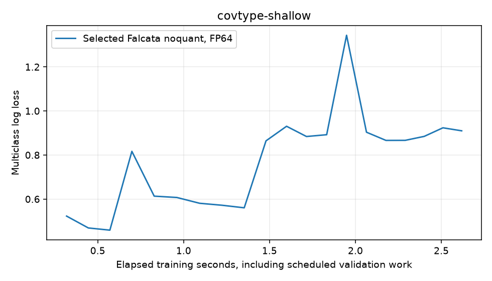

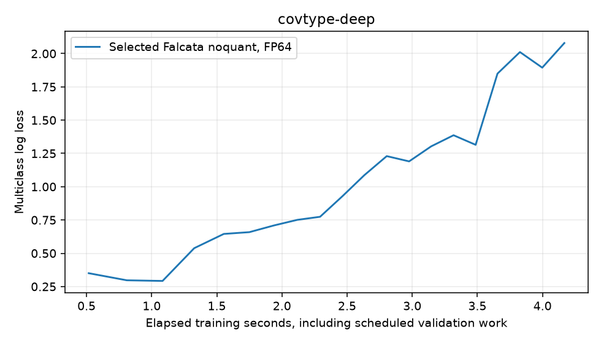

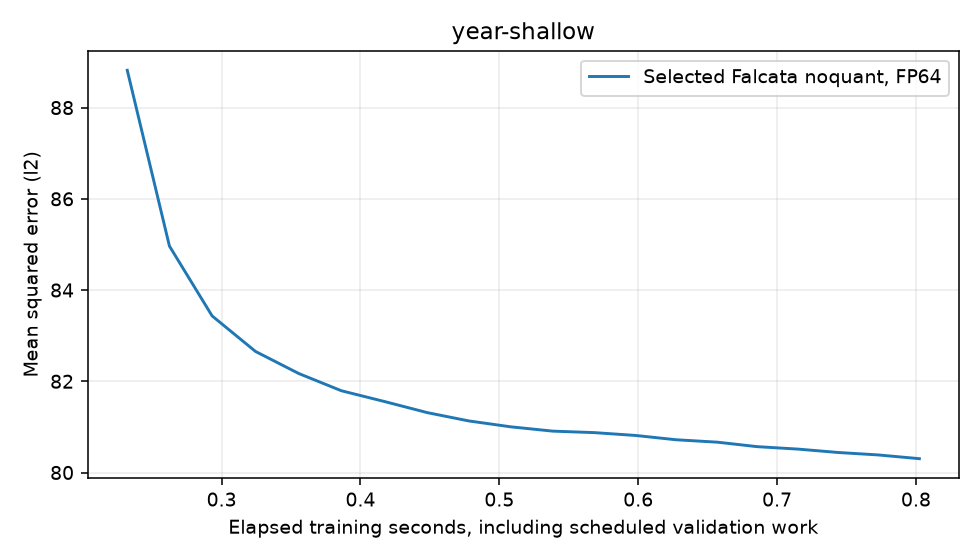

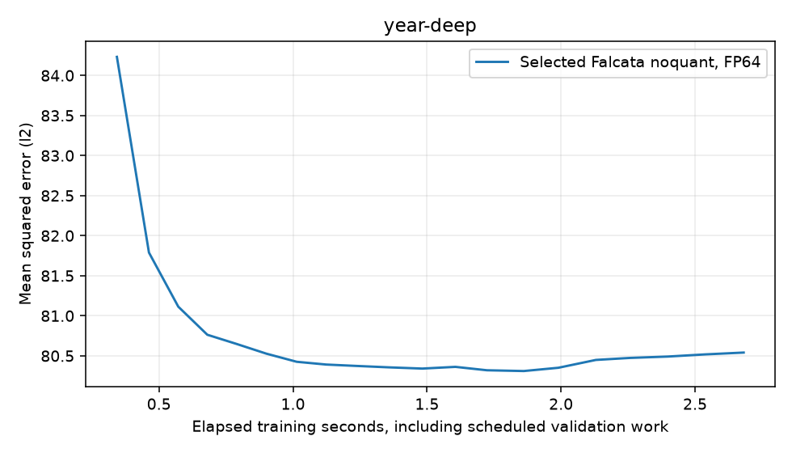

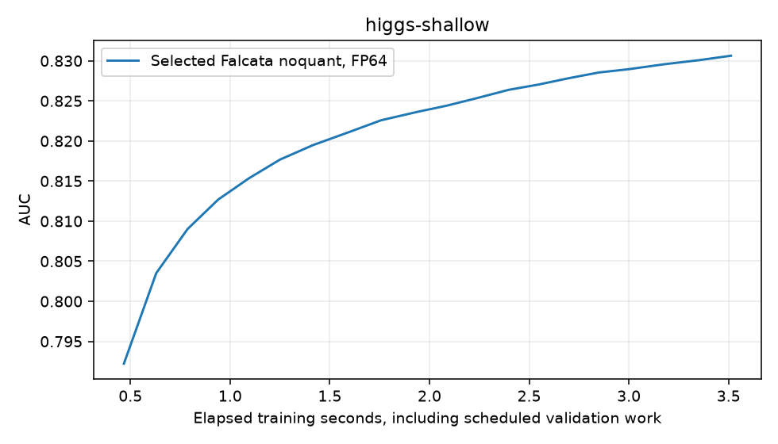

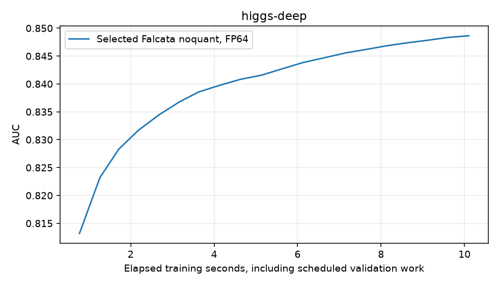

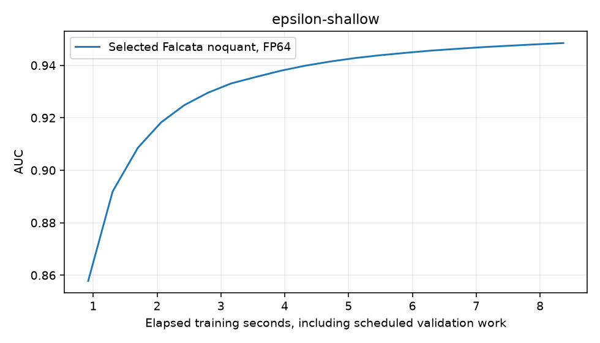

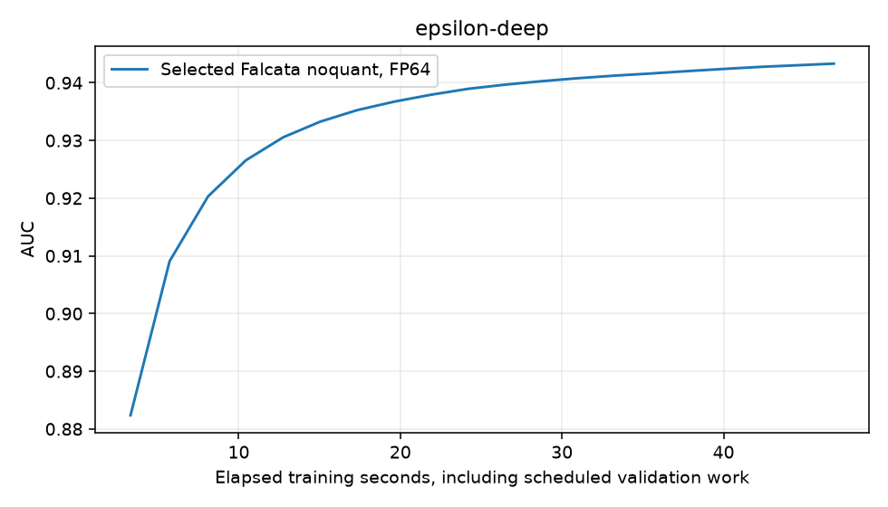

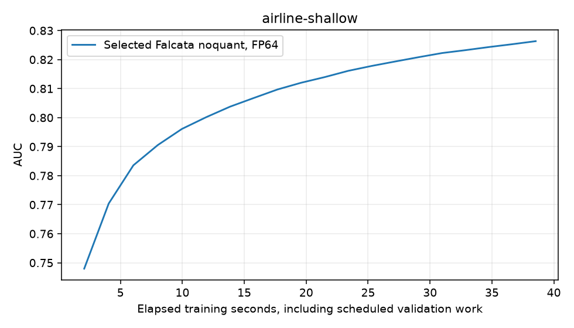

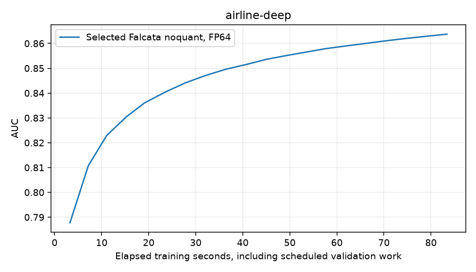

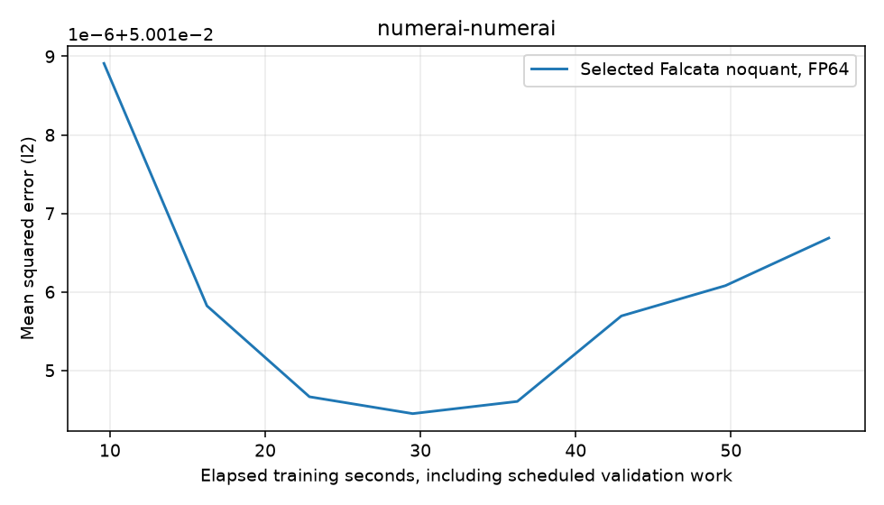

Numerai int8 inputs are explicitly pinned to match the existing strict jobs. The historical cached label is unidentified;
these measurements reproduce implementation behavior and provide no current production/prequential selection evidence.

October8 construction/RSS comparisons are harness/dtype-confounded. Earlier grouped runs could share a constructed Dataset
and some Numerai comparisons used float32; these fresh-process runs reconstruct each cell and use int8 Numerai.
Construction and memory endpoints remain in the raw sidecar; no optimization benefit is inferred from that confounded comparison.

Installed library SHA256: `e67a7ad314a75cec7414ecdcfaa05895040191f50c86c960c432bce919d0a90c`.
Manifest SHA256: `9a3be069eee56031baa9dd1c17a58b039099057dbc043c868db2b9a074631e3c`.
