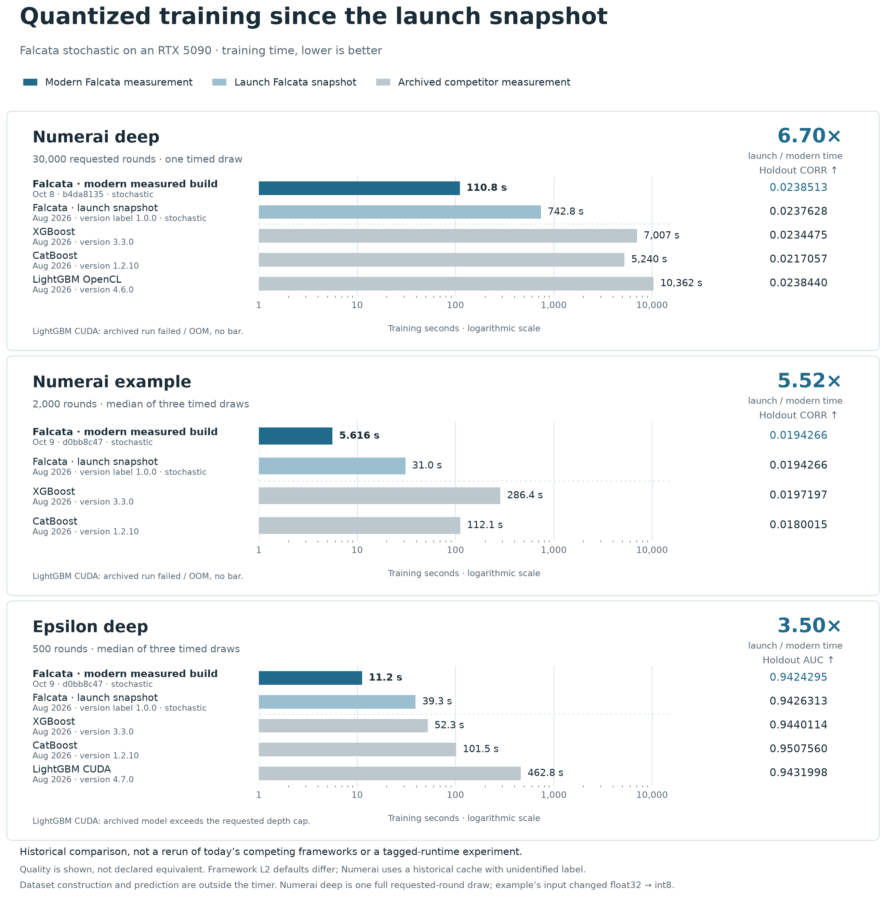
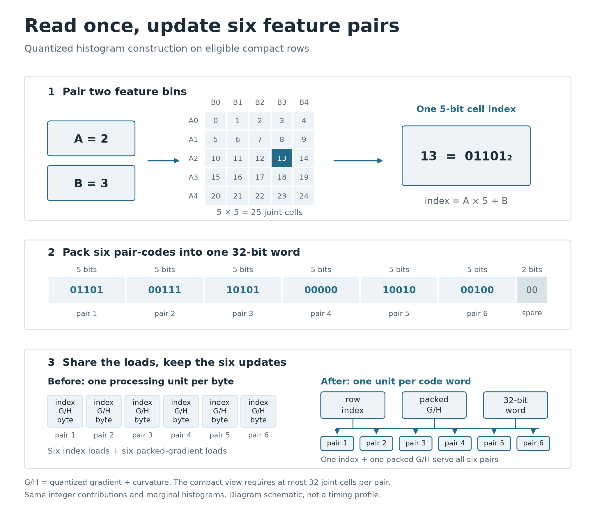
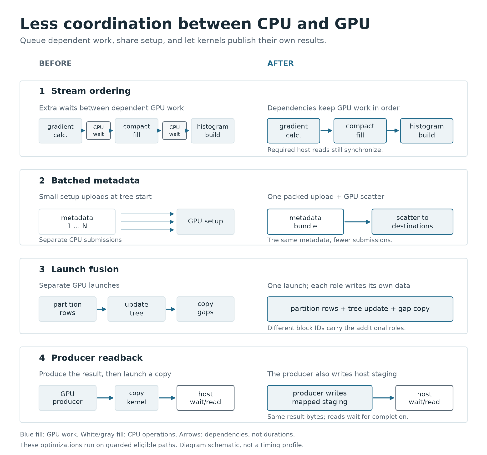

# Falcata 1.1: widening the gap

> **Release article draft, 9 October 2026.** An overview of the work since our
> first release, including features shipped in 1.0.x and the pending changes in
> [PR #71](https://github.com/MechaFauna-ai/Falcata/pull/71). Version 1.1 is proposed;
> it has not been published.

When we [introduced Falcata](https://www.mechafauna.ai/blog/falcata-gpu-gradient-boosting),
we showed what happens when gradient boosting gives the GPU a whole level of tree
work at a time. That architecture opened a substantial lead. Since then, we have
been working through the bottlenecks it exposed: redundant data movement, tiny
histogram tasks, repeated loads and conversations with the CPU.

The accumulated progress is substantial. **The 30,000-round Numerai-deep workload
fell from 12.4 minutes at launch to 1.85 minutes: about 6.7× faster.** Numerai
example now takes **5.6 seconds instead of 31**, a 5.5× improvement; Epsilon deep
takes **11.2 seconds instead of 39.3**, a 3.5× improvement. These are quantized
workloads. The latest changes also reduce non-quantized training time by as much
as **39.4%** in the measured October comparisons.

These numbers describe different comparisons. The quantized results compare a
historical launch snapshot with strict, quiet-machine October runs; the FP64 result
compares two October development builds. The configurations, quality scores and full results
are in the [benchmark companion](falcata-1.1/benchmarks.md).

## The gap, then and now

On the deep Numerai workload, the October quantized measurement is about **63×
faster than the launch XGBoost time, 47× faster than CatBoost and 94× faster than
LightGBM OpenCL**. The launch ratios were roughly 9×, 7× and 14×.
On Numerai example, the latest Falcata time is about **51× shorter than the
launch XGBoost time and 20× shorter than the launch CatBoost time**. On Epsilon,
the corresponding ratios are **4.7× and 9.0×**. These are training-budget
comparisons against the original competitor measurements, which have **not**
been rerun. Quality differs: for example, Epsilon AUC is 0.94243 for the new
Falcata run and 0.9508 for the launch CatBoost run. They are not claims about
equal-quality training or today's versions of those engines.

The deep result is one full 30,000-requested-round run on the October 8 quantized
build, with holdout CORR 0.02385. The example and Epsilon results are medians of
three timed runs on the October 9 selected build. All ran on one RTX 5090, admitted
serially by GPUQ's strict policy with no recorded contention. Times exclude dataset
construction and prediction. The workload sizes and training budgets match the
launch cases; deep Numerai used float32 in both snapshots, while the new example
uses native int8. The launch artifact predates the actual v1.0.0 tag. These are
dated benchmark comparisons, not a controlled tagged-release comparison.

Most of this progress comes from the quantized path. Here are the three changes
that best explain it.

## 1. Give each tree the data it will actually use

Numerai is an unusually wide workload: 3,555 features, each with only a few values.
A tree that samples 10% of those features should not stream all 3,555 columns
through memory every time it builds a histogram.

Falcata already had a **compact view** at launch: a smaller matrix containing the
columns sampled by that tree. The newer work makes that view cheaper to obtain.
The GPU keeps one persistent **column-major** store, where values from one feature
sit together. A tiled gather fills the per-tree view from contiguous reads;
when almost all features are used, a measured layout choice can instead retain a
full row-major view and apply a feature mask.

This removes a surprisingly expensive detour: keeping both full layouts, packing
the matrix on the CPU, uploading it, then transposing it. In the documented
6.79-million-row experiment at `feature_fraction=0.1`, steady peak device memory
above idle fell from **25.0 to 13.7 GiB**, and first-round setup fell from
**2.49 to 0.64 seconds**. The layout probe can temporarily use more memory while
testing its candidates.

Making the intended fast paths eligible at the real wide shape mattered too.
Tiled fill and warp split search took the measured deep round from **29.6 to
18.3 ms**, and the example round from **17.0 to 9.0 ms**, with the same models.
Those are local, interleaved experiments, not factors to multiply into the launch
comparison.

For CUDA readers: the later fill aligns column pitches to 32-byte sectors, so
word staging also works with odd row counts. It prefetches upcoming tiles into L2,
the GPU's shared cache. The profiled fill reached **83% of peak DRAM bandwidth**;
at that point, reducing bytes and passes matters more than adding threads.

Code: [direct layout](https://github.com/MechaFauna-ai/Falcata/commit/3d659149c3fd6744f415b0397d5f1d06f9755da5),
[tiled fill](https://github.com/MechaFauna-ai/Falcata/commit/be92c00500901b4ee63ee4a990142d87b83acd50),
[alignment and prefetch](https://github.com/MechaFauna-ai/Falcata/commit/06ef5a46e4107ebbc745acf48edf2609ce79e1eb).

## 2. One load, six feature pairs

A tree chooses a threshold using **histograms**: sums of gradients and Hessians
for each feature bin. Gradients describe the direction a prediction should move;
Hessians describe the local curvature of the loss. Quantized training represents
these contributions with small integers, making accumulation cheaper and
independent of its execution order. Stochastic mode uses seeded randomized
rounding; fixedpoint uses deterministic rounding with an outlier-robust scale.
`quant_mode="none"` retains floating-point histograms. Gradient quantization is
separate from feature binning and remains a speed/quality choice.

Low-cardinality features offer another opportunity. For two five-valued features,
there are only **25 joint states**. Instead of constructing two separate
histograms, we accumulate one joint table. Summing its rows or columns recovers
the two ordinary histograms exactly, for the same quantized contributions.
One joint-cell update replaces two feature updates; split search still sees the
original features, rather than a new interaction feature. In its same-build
ablation, turning joint construction OFF added **45.6% to round time**.

That joint-state index needs only **five bits**. Six indices fit in a 32-bit word,
with two spare bits. For the sampled Numerai view, sector-padded rows shrink from
**178 to 128 bytes** within the existing allocation: 28% fewer bytes to write.

But compression alone was not the big win. An earlier experiment read 36% fewer
bytes and gained only 2–3%. The profiler showed a **load/store issue bottleneck**:
the GPU was busy issuing requests, not simply exhausting memory bandwidth.

The decisive change was assigning one thread a whole code word. One row-index
load and one packed gradient/Hessian load now serve **six feature pairs**. A warp,
the GPU's group of 32 threads, covers a compact row with **coalesced reads**:
neighboring threads access adjacent words, which combine into efficient requests.
The six histogram updates still happen; their shared inputs are fetched once.

The construct kernel issued **63% fewer load/store instructions** and fell from
**2.05 to 1.27 ms**. Across 12 interleaved pairs, the complete measured round fell
from **4.67 to 3.84 ms: 1.217× faster**, with identical model fingerprints.
Full 30,000-tree comparisons in that experiment measured **202.1 to 246.4 trees/s**.
This specialization engages only on eligible sampled, packed views whose feature
pairs have at most 32 joint cells.

Treating missing values as a sixth bin can exceed that limit: six-by-six pairs
need 36 cells. In a separate paired Numerai run, the standard recipe still trained
30,000 trees at **193 trees/s**, versus **266** with five states. Configuration
matters: a larger declared leaf budget crossed a memory threshold and selected
a slower full-width view, reaching **10.3 trees/s** in short probes. The
[paired measurements and diagnosis](falcata-1.1/benchmarks.md#five-values-versus-five-values-plus-missing)
explain where the remaining fast paths engage.

Code: [joint histograms](https://github.com/MechaFauna-ai/Falcata/commit/4da13ec904d51eb851eba7ec5187ff69a78fd1c1),
[five-bit view](https://github.com/MechaFauna-ai/Falcata/commit/4767ce8bc1ee358d50e51fd5098db1b3e7005e27),
[one thread per word](https://github.com/MechaFauna-ai/Falcata/commit/f8417c77906b85ddd1dc8a3b17467c46eff353e5).

## 3. Keep useful work in flight

A fast histogram kernel can still spend much of its time waiting for scattered
memory reads. **Occupancy** describes how much thread work can remain resident on
a GPU multiprocessor. Enough independent work lets it execute another warp while
the first waits for data.

Our earlier pair construct used 64 registers, the fast storage private to each
thread, and could keep only one block
resident. A spill-free 48-register variant, selected using CUDA's occupancy API,
kept **36 warps resident** in the measured shape. Shared-memory allocation was
also constrained so those blocks did not needlessly squeeze the L1 cache.
A 40-register version spilled temporary values into slower memory and lost; it was
rejected. A later, different code-word body reached 40 registers by removing
branches and changing the work, rather than imposing the same losing cap.

Work scheduling extends beyond the kernel. Roughly fourteen tiny metadata uploads
became one upload and a GPU scatter. Compatible partition, tree-update and gap-copy
work share a launch. Producing kernels write their own mapped host staging
(CPU-visible transfer buffers), and
stream dependencies order work without making the CPU wait at every intermediate
step. **Required host reads still synchronize.**

We also stop preparing answers nobody can use: leaves too small to form two legal
children skip histogram construction and split search; constant-Hessian objectives
avoid rereading a constant array; completed levels skip unnecessary partitioning.

One measured optimization package reduced a round from **5.82 to 5.09 ms** over
12 interleaved pairs, with identical models. Its profile cut split search from
**161 to 94 µs** and a level synchronization kernel from **82 to 28 µs**.
The [performance notes](../performance.md#10c-the-numerai-round-after-56-the-fill-engages-the-level-kernels-shrink-the-host-round-trips-go)
separate these kernel observations from complete training results.

Code: [resident work](https://github.com/MechaFauna-ai/Falcata/commit/be446048d326c0382ef067cca6c9bfe568f67d14),
[metadata batching](https://github.com/MechaFauna-ai/Falcata/commit/0199a6a30fb7aa70ec1b3d1fba7eb932332bc558),
[producer readback](https://github.com/MechaFauna-ai/Falcata/commit/3e6fcdf369134c3347315586ebeb139a3515d64c).

## Beyond the quantized hot loop

The same iteration has improved the rest of the library:

- **Split search on broader data.** Warp-sized tasks, conservative FP32 screening
  and compacted candidate lists reduce expensive exact work while preserving the
  winning split. The documented 40-bin synthetic workload improved **1.459×**;
  the low-bin Numerai route was unchanged by that particular package.
  [Commit](https://github.com/MechaFauna-ai/Falcata/commit/c35442a0892187111f0514b9a6b824f6a6a49b0e).
- **Non-quantized training.** The pending FP64 scans and graph bookkeeping reduce
  training time by **21.8% on Year, 19.3% on Epsilon and 39.4% on Higgs** versus
  the October baseline. Numerai example improves 1.8%; a single full deep pair
  improves 9.9%, from 22.88 to 20.61 minutes. Parallel scans change addition order;
  deterministic routes retain their CPU-order scans. **FP64 remains default**;
  FP32 remains explicit. [Code and evidence](https://github.com/MechaFauna-ai/Falcata/pull/71).
- **Faster preparation and bounded prediction.** Reused page-locked staging buffers
  overlap chunk transfers with binning; CPU sampling uses radix sorting and avoids
  redundant initialization. FIL now predicts wide host inputs in bounded slabs.
  Native int8 construction measured **3.89 s versus 31.34 s for float32**, with
  **32.3 versus 64.9 GiB** peak host RSS. That is an input-representation comparison,
  separate from the training speedups.
  [Transfer overlap](https://github.com/MechaFauna-ai/Falcata/commit/566a0cff3743f1042b0724f3726a3395af5982da),
  [prediction slabs](https://github.com/MechaFauna-ai/Falcata/commit/f88b34ad996c2b1f9cf35cd7472909e5f766941a).
- **More expressive models, already in 1.0.5.** Vector leaves predict up to 16
  targets from one shared tree; ObliquePool adds sparse projections for slanted
  decision boundaries; seeded random categorical subsets offer another search
  strategy. Chunked device input and packed storage broaden the data interfaces.
  Benefits depend on shape rather than one universal multi-target multiplier.
  [Release and implementation links](https://github.com/MechaFauna-ai/Falcata/releases/tag/v1.0.5).
- **Stronger contracts.** Model round trips, importer ordering, live parameter
  updates and CPU-only imports have been hardened. Quantization-scale Hessian
  regularization prevents tiny rounded denominators from producing extreme
  updates; affected models intentionally change.
  [Lifecycle fixes](https://github.com/MechaFauna-ai/Falcata/commit/116f8b54d74f6c494cb05d47636df16e10fb24e2),
  [Hessian ridge](https://github.com/MechaFauna-ai/Falcata/commit/ef8203fbf33eaee6b76a147e3b86f997c47882ab).

## Speed has to survive the checks

The selected runtime passed four canonical model gates and a 357-cell verification
lattice. The touched CUDA suite passed 284 cases, with ten skips and four expected
failures. Mechanical optimizations have identity checks; numerical changes also
need fresh quality evidence.

That discipline keeps losing experiments visible. Forced quantized CUDA graphs
were slower in all seven historical cases rerun, so they remain opt-in. Uncapped
FP64 fraud runs produced extreme leaf updates and saturated probabilities; their
failures remain recorded. Explicitly capping updates with `max_delta_step=1`
passed all ten strict follow-up endpoints at AUC around 0.979, as a separately
labelled configuration. Covtype's unstable draws stay outside the headline claims.

The [companion](falcata-1.1/benchmarks.md) includes all quantization modes, earlier
measurements, exclusions and links to raw evidence. Fresh October 9 Numerai scores
use `NumeraiEvaluator(cpu)` on a pinned historical benchmark cache; its target label
is unidentified, so this is implementation evidence rather than production model
selection. The [dead ends](../perf-dead-ends.md) record ideas that did not earn a
place in the defaults.

The familiar `falcata.train()` API remains. The largest gains came from asking
more useful questions of the same hardware: which bytes does this tree need,
which loads can its features share, and which waits does the algorithm require?

Falcata is MIT licensed and derives from LightGBM (Microsoft Corporation and the
LightGBM developers). [Code and contributions](https://github.com/MechaFauna-ai/Falcata).
