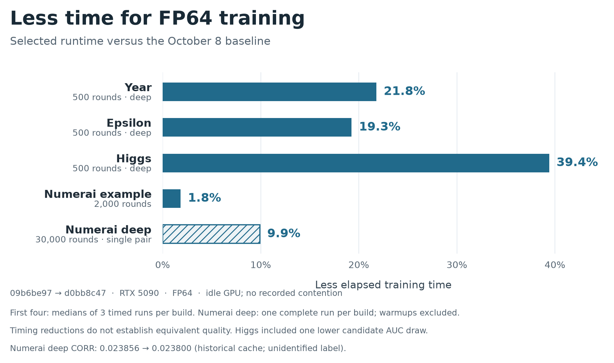
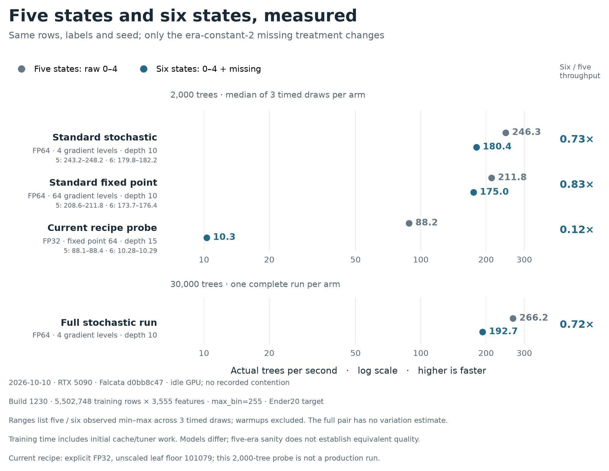

# Falcata 1.1 article: measurements and release scope

Editorial companion, 9 October 2026. The [article](../falcata-1.1.md) keeps the
main narrative short; this file keeps the comparisons and limits inspectable.
The proposed 1.1 release has not been published. These measurements span the
launch snapshot, subsequent 1.0.x development and pending [PR #71](https://github.com/MechaFauna-ai/Falcata/pull/71).

## Which comparisons the article makes

| Comparison | Before | After | Interpretation |
| --- | --- | --- | --- |
| Launch → October quantized | August launch benchmark, labelled 1.0.0; covtype forensics identify the pre-tag artifact `724e9358` | October 8 `b4da8135`, or October 9 `d0bb8c47` where a matching strict control exists | Dated workload snapshots, not a controlled tagged-v1.0.0 → tagged-v1.1 experiment |
| Latest non-quantized work | October `09b6be97` | Selected `d0bb8c47` | New PR #71 work beyond the already optimized October baseline |
| Mechanism experiments | Each documented preceding development build, or a same-binary key OFF | The corresponding key/package ON | Local effects with their own shapes and timing windows; do not multiply them into a release claim |
| Other frameworks | August benchmark versions and configurations | No new competitor measurement | Archived reference bars, not claims about current engine releases |

Every chart measures training, excluding construction, prediction and evaluation.
The benchmark convention retains each engine's own default L2 penalty, so engines
also differ in regularization and model structure. Equal tree budgets do not
establish equal-quality training. All workloads use one RTX 5090.

The launch snapshot is recovered from
[the original committed raw file](https://github.com/MechaFauna-ai/Falcata/blob/8c28184f25564f786d9ef042a6af4acdd680bdc3/docs/perf-plots/data/runs.jsonl).
The currently checked-in performance snapshot replaces covtype's Falcata rows
after the Hessian-ridge correction; it must not be treated as an untouched launch
file. Covtype forensics establish a pre-tag launch artifact; individual appended
launch records do not pin their binaries. They cannot certify an exact
[v1.0.0-tag runtime](https://github.com/MechaFauna-ai/Falcata/releases/tag/v1.0.0).

## Framework figure


The [compact chart data](framework-comparison-data.json) and
[generator](plot_framework_comparison.py) retain exact values and provenance.
The [complete matrix](benchmark-matrix.json) includes all fifteen workloads,
three Falcata modes, archived competitors, compact raw endpoint identities,
quality intervals, failures and source hashes. The
[full forty-five-row mode table](appendix-table.md) shows every Falcata workload
and mode in a readable form, including missing and failed endpoints. The
[full framework table](framework-table.md) shows all fifteen workloads alongside
the archived competitor timings and quality ranges, including optional
loss-guide and quantized-LightGBM variants.

**Numerai deep:** 5,463,797 training rows × 3,555 features; 30,000 requested rounds,
learning rate 0.001, depth 10, 1,024 leaves, feature fraction 0.1,
`min_data_in_leaf=10000`, `max_bin=255`, seed 42 and 32 CPU threads.
Stochastic quantization resolves to four gradient bins. The October 8 time is
110.798968 seconds, one complete timed draw, on runtime
[`b4da8135`](https://github.com/MechaFauna-ai/Falcata/commit/b4da81352d5f9528699af9ea46a05ebbbeb091f3).
The run completed on an otherwise idle GPU, with no recorded contention.
The contemporaneous library
MD5 `58897acd3df952c1989b8e354ed09a17` matches the retained installed binary.
No plan overrides were supplied; `pair_code5_epilogue` was OFF. Both launch and
October deep inputs were float32. The old harness omits an accepted-tree counter,
so its recipe certifies requested rounds rather than a newly audited tree count.
Archived CORR is 0.0238513. Total cell time including CPU prediction was about
709.7 seconds; 110.8 seconds is not an end-to-end inference claim.

**Numerai example:** same training shape, 2,000 rounds, learning rate 0.01,
32 leaves, depth 5 and feature fraction 0.1. October 9 selected stochastic
median: 5.615935 seconds; CORR 0.0194266. Three timed draws on an otherwise
idle GPU, with no recorded contention. The new input is int8; the historical input was float32.

**Epsilon deep:** 400,000 training rows × 2,000 features, 500 rounds,
learning rate 0.1, 1,023 leaves and depth 10. Selected stochastic median:
11.220135 seconds, AUC 0.9424295; three timed draws on an otherwise idle GPU,
with no recorded contention. Both snapshots use float32. Archived competitor AUCs
differ, particularly CatBoost's 0.9507561. Do not describe these bars as an
equal-quality result.

The selected runtime is
[`d0bb8c47`](https://github.com/MechaFauna-ai/Falcata/commit/d0bb8c47789e062acbf6b770918a0589a74ae9b2),
library SHA256
`e67a7ad314a75cec7414ecdcfaa05895040191f50c86c960c432bce919d0a90c`.
Its strict source records are retained in the
[dated timing evidence](https://github.com/MechaFauna-ai/Falcata/blob/523ed775ad2eec9eeca147c4815c39a8f9400f70/docs/2026-10-09_noquant-timings/strict-timing-evidence.json).

October 8's other quantized cells describe that actual build, not silently the
later selected runtime. In particular, binary fixedpoint rows precede the
variable-Hessian ridge and cannot establish final-build quality. The replacement
covtype rows identify their post-ridge build explicitly. Constant-Hessian
unweighted regression does not take that ridge. The complete matrix preserves
these distinctions instead of selecting the fastest record from each build.

Historical Numerai scores retain their original benchmark evaluation. The fresh
October 9 quality records use `NumeraiEvaluator(cpu)`. Their cache's label identity
is unidentified; these are reproduction metrics, not target selection,
prequential evidence or a production release.

## Non-quantized measurements

| Workload | October baseline | Selected FP64 | Less time | Timed draws per build |
| --- | ---: | ---: | ---: | ---: |
| Year deep | 3.50 s | 2.74 s | 21.8% | 3 |
| Epsilon deep | 57.77 s | 46.64 s | 19.3% | 3 |
| Higgs deep | 15.93 s | 9.66 s | 39.4% | 3 |
| Numerai example | 54.81 s | 53.81 s | 1.8% | 3 |
| Numerai deep | 1372.53 s | 1236.51 s | 9.9% | 1 |



Exact medians, source identities and quality ranges are in the
[source data](training-time-data.json), generated by
[plot_training_time.py](plot_training_time.py). The deep pair's CORR moves from
0.0238562 to 0.0238004; one pair does not establish repeatability or equivalent
quality. Year/Epsilon ranges overlap; Higgs includes a lower-scoring draw.
Covtype and uncapped fraud remain outside headline speed claims because of
unstable/failed models. Parallel FP64 scans can alter addition order; eligible
deterministic routes retain their CPU-order scans. FP64 remains default; FP32 and
conditional `auto` are opt-in.

The completed overnight scope was 35 jobs: 33 done, two retained fraud failures,
zero pending and zero recorded contention. It covered 196 unique endpoints after
25 reused records. All configurations, learning curves and exclusions remain in
the [immutable report](https://github.com/MechaFauna-ai/Falcata/blob/523ed775ad2eec9eeca147c4815c39a8f9400f70/docs/2026-10-09_noquant-timings.md).

Fraud's follow-up distinguishes model instability from scoring representation:
tiny Hessians permitted huge finite leaf updates; probabilities saturated while
raw-margin ranks retained information. CPU raw-margin AUC matched native AUC,
and CPU probabilities matched cached probabilities. With explicit
`max_delta_step=1`, all ten new strict endpoints passed, all built 500 trees,
and AUC was around 0.979. This is a changed, separately labelled configuration;
it does not replace the uncapped failures. See the
[diagnosis and rerun](https://github.com/MechaFauna-ai/Falcata/blob/523ed775ad2eec9eeca147c4815c39a8f9400f70/docs/2026-10-09_fraud-followup.md).

## Mechanism measurements

These have different local baselines. Profile timings describe kernels; ablations
describe a complete measured round. Leave-one-out effects interact.

| Change | Recorded effect | Scope and limitation |
| --- | --- | --- |
| Direct column-major lifetime | 25.0 → 13.7 GiB above idle; first round 2.49 → 0.64 s | Full 6.79M-row, 3,555-feature shape, feature fraction 0.1; live probe can briefly use more memory |
| Wide fast paths engaged | Deep 29.6 → 18.3 ms; example 17.0 → 9.0 ms | 300-round interleaved probes on the full 6.79M-row shape; identical models |
| Pair-joint histogram | Turning it OFF adds 3.85 ms/round, 45.6% | Same-build leave-one-out, four pairs; this does not mean 45.6% less elapsed time |
| Root histogram during compact fill | OFF adds 0.83 ms/round, 9.9% | Same branch/four pairs; interacts with pair-joint construction |
| Occupancy and tree scheduling package | 5.95 → 5.38 ms, 1.105× [1.099, 1.111] | Six interleaved pairs; 500 rounds timed from 200; identical models |
| Fill, level kernels and host scheduling | 5.82 → 5.09 ms, 1.143× [1.130, 1.156]; 163.3 → 185.6 trees/s at 30k | Twelve per-round pairs; full-run 2×ABBA; identical models |
| Five-bit code-word package | 4.67 → 3.84 ms, 1.217× [1.211, 1.223]; 202.1 → 246.4 trees/s at 30k | Twelve per-round pairs; full-run ABBA; only eligible sampled compact shapes |
| Code-word grid/readback/apply follow-on | 3.950 → 3.607 ms, 1.095× [1.053, 1.141] | Three interleaved pairs, rounds 200..30000; identical models |
| Experimental full-run follow-on | 246.2 → 268.2 trees/s | ABCCBA with `pair_code5_epilogue` ON; it later lost 0.5% in isolation and defaults OFF |
| Generic warp finder, covtype | 4.94 → 4.27 ms, 1.157× | Actual fixedpoint deep workload, 1,000 rounds, three pairs; same model |
| Generic warp finder, Higgs-like | 2.89 → 2.63 ms, 1.094× | Generated 4M×28 continuous shape; same model |
| Generic warp finder, Epsilon-like | 9.41 → 6.44 ms, 1.459× | Generated 388k×2,321, 40-bin shape; not real Epsilon |
| Generic warp finder, Year-like | 4.34 → 3.91 ms, 1.109× | Generated 3.4M×93 continuous shape; same model |
| Generic warp finder, Numerai | 3.964 → 3.976 ms, 0.997× | Narrow tasks do not take the changed generic finder |
| Native input representation | int8 3.89 s/32.3 GiB RSS versus float32 31.34 s/64.9 GiB | Fresh construction within one build; no held-out scoring and no causal before/after attribution |
| Forced quantized graphs | ON slower in all seven rerun cases | Same selected binary, matching timed fingerprints; remains opt-in |

The [performance notes](../../performance.md) contain the experiments and guards.
The [mechanism generator](plot_mechanisms.py) reproduces both diagrams. Their
arrows describe dependencies, not measured durations; required host reads still
synchronize.

## Other changes since the original release

Hybrid level batching, compact views, FIL, FALB, GPU-native ingestion, runtime
construct JIT, the tuner/wisdom stack and level-batched NCCL were already present
in v1.0.0. Their original ablations should not be marketed as newly added gains.

| Family | Since-launch additions | Implementation |
| --- | --- | --- |
| Modeling | Vector-leaf multi-regression up to 16 targets; ObliquePool sparse projections; random categorical subsets | [Vector integration](https://github.com/MechaFauna-ai/Falcata/commit/428307adde2d9f74c272778d1d0d6823f049a3b1), [projections](https://github.com/MechaFauna-ai/Falcata/commit/5f91b4cf17a1f05c698869ab31dfbe22bd85ea83), [categories](https://github.com/MechaFauna-ai/Falcata/commit/ab8264b8139374a2df469e120c8a8536227479c9) |
| Data interfaces | Packed/chunked CUDA arrays, device dataset builder, integer/float16 missing sentinels | [Builder](https://github.com/MechaFauna-ai/Falcata/commit/929580a7a68d4596ab91adb4adc66dce7185d31c), [sentinel](https://github.com/MechaFauna-ai/Falcata/commit/570c1e80c07b22486a4b3d58877b5b4bf7c7eaf2) |
| Training controls | Evaluation frequency, evaluation-count early stopping, minimum iterations, callback state repair | [Frequency](https://github.com/MechaFauna-ai/Falcata/commit/57f714ceee62a09eaeab46703580a20a6841fcbb), [minimum iterations](https://github.com/MechaFauna-ai/Falcata/commit/89f7456dbb5b91f6ad5f93fb07b72e594f5d64cb) |
| Preparation | Pooled pinned buffers, chunk-copy/binning overlap, radix sorting, avoided initialization, early CUDA context creation, device categorical binning | [Overlap](https://github.com/MechaFauna-ai/Falcata/commit/566a0cff3743f1042b0724f3726a3395af5982da), [radix sorting](https://github.com/MechaFauna-ai/Falcata/commit/56cf5e8b103467af5098be73b2b2de35bc967a12) |
| Numerical contracts | Deterministic CPU-order histogram/split routes; error-feedback dither; Hessian-quantum ridge under bagging and variable Hessians | [Parity](https://github.com/MechaFauna-ai/Falcata/commit/d53aa45c4bc1d3e44959b47dfd625635699a3386), [dither](https://github.com/MechaFauna-ai/Falcata/commit/75a77dc08e25dfca03d46fa79f1e9611f4e7ea77), [ridge](https://github.com/MechaFauna-ai/Falcata/commit/ef8203fbf33eaee6b76a147e3b86f997c47882ab) |
| Lifecycle | Importer routing/order, constant trees, model round trips/statistics, transactional mode resets and cached-predictor invalidation | [Lifecycle](https://github.com/MechaFauna-ai/Falcata/commit/116f8b54d74f6c494cb05d47636df16e10fb24e2), [reset guard](https://github.com/MechaFauna-ai/Falcata/commit/dbcdab292ffe398e0bd248bd2a48f9a41647f2ba) |
| Prediction | FIL bounded slabs and large-input indexing repairs | [Slab scoring](https://github.com/MechaFauna-ai/Falcata/commit/f88b34ad996c2b1f9cf35cd7472909e5f766941a) |
| Distribution | Automatic CUDA selection, toolkit/wheel repairs, lazy CUDA-driver/NCCL loading, CUDA 13 support; 1.0.5 wheel 99.1 → 71.3 MB | [Lazy driver](https://github.com/MechaFauna-ai/Falcata/commit/ea8301a509cb45f87bdf45f8b28b9fa3589833df), [1.0.5 notes](https://github.com/MechaFauna-ai/Falcata/releases/tag/v1.0.5) |

## Five values versus five values plus missing

The historical headline benchmark retains the original imputed values. This
separate paired comparison uses the Numerai pipeline's exact conversion:
features constant at 2 over a complete source era become native int8 -1, then
real NaN for CPU prediction. Ordinary twos and zeros stay numeric. Build 1230
was frozen because the historical full build 1226 source is no longer available.
Both arms have the same 5,502,748 training rows, 3,555 features and named Ender20
target. These times must not be compared as a release speedup against the old cache.

| Recipe | Trees per draw | Five-state trees/s | Six-state trees/s | Six/five training time |
| --- | ---: | ---: | ---: | ---: |
| Standard stochastic, FP64 | 2,000; median of 3 | 246.28 | 180.36 | 1.365× |
| Standard fixed point, FP64 | 2,000; median of 3 | 211.77 | 174.99 | 1.210× |
| Current recipe, fixed point, explicit FP32 | 2,000; median of 3 | 88.21 | 10.29 | 8.576× |
| Standard stochastic, FP64 | 30,000; one pair | 266.19 | 192.65 | 1.382× |



The full six-state run accepted all 30,000 trees in **155.721 s**, versus
**112.702 s** with five states: 38.2% more training time. Construction, CPU
prediction and canonical metric evaluation are measured separately. All 27
frozen records completed on an otherwise idle GPU with no recorded contention; failed,
pending, blocked and contended/excluded counts are zero. The prerequisite gate
established exact trees/bin metadata/prediction parity for native int8 sentinel,
float16 NaN and float32 NaN.

The standard six-state warmups retain compact sampled columns, tiled fill,
pair-joint histograms and FP64 warp split finding. Six-by-six pairs need 36
joint cells, beyond the five-bit view's 32-cell limit; six-by-five needs 30.
The five-state standard warmups engage code5 in 191/200 trees, versus 0/200
with missing values. Warmup observations do not trace every timed launch.

The current recipe's much larger penalty has a different explanation. Its
16,384-leaf declared capacity raises the future-allocation reserve from 10,701
to 15,922 MiB when missing-routing tasks are added. Diagnostic logs show the
six-state compact view no longer fits; the planner falls back to a full-width
masked view and `row_batch` histogram construction. The five-state arm uses
compact `pair_hist`. Neither recipe arm engages code5. This observed branch
change strongly explains the cliff, but no new ablation assigns its exact share
of the slowdown or demonstrates a fix. The 2,000-round probes do not predict
the recipe's full 15,000-round training time.

Canonical `NumeraiEvaluator(cpu)` metrics use only complete held-out eras
1226–1230 as finite/nonconstant sanity checks. The models differ across arms;
these scores establish neither equal quality nor a production or prequential
selection verdict. FP64 remains the library default.

[Dated report](../../2026-10-10_numerai-six-state-throughput.md),
[compact endpoint evidence](six-state-data.json), and
[portable chart generator](plot_six_state.py) preserve all draws, actual bin
counts, parameters, fingerprints, separate timings and the source-linked
memory diagnosis.

## Kernel evolution history

The [offline lineage explorer](lineage-explorer.html) is a reader view of the
search history behind the article. Download the HTML file and open it in a
browser; its data, styles and scripts are embedded, with no network requests or
live experiment controls. GitHub displays HTML source rather than running this
interface. The same artifact can be served alongside the article when it is
published later.

The page explains the evolutionary loop—inherit, vary, evaluate, select and
repeat—before opening its lineage. Early replay searches used parent and
inspiration sampling in OpenEvolve; later whole-library searches used a scripted
operator, isolated coding branches, written hypotheses and independent review.
The page focuses on how those searches developed; the article explains the
resulting CUDA optimizations. A combined-parent edge identifies a second branch
offered to the worker, without asserting that every change was incorporated.

The frozen export contains **532 archived records**: 141 whole-library search
records and 391 isolated replay evaluations. One started, interrupted worker
without a final archive brings the attempt-record count to **533**. These are
records, including duplicates, imported seeds and re-evaluations, rather than
533 unique implementations. Thirteen campaign baselines, fourteen documented
integration milestones and seven explicit references bring the graph to 567
nodes. The references cover three retained best-program metadata records, three
unavailable early parents and the missing predecessor named by the interrupted
worker. Seven smoke/development/dry archive records are excluded; unrelated
GEMM experiments and measurement-only folders are outside this Falcata scope.

The 264 edges distinguish recorded starting-state parents, combinations, idea
continuations, cross-branch reuse and documented integration. Twenty-three
integration edges connect public implementation commits to later campaign
baselines through verified Git ancestry. These establish code presence; they
do not assign a share of a performance gain. Original candidate hashes can be
local search objects, so only verified public hashes receive GitHub links.

Training timings, dataset construction, kernel replays and multi-shape split
search use separate metric labels. Outcomes such as improved or regressed compare
a candidate with its parent; displayed ratios compare it with the measurement
baseline. Imported `night3:c047`, `night5:c088` and `construct2:k007` retain earlier
measurements, explicitly scoped to their source campaigns. No cross-campaign
ratios are multiplied or ranked as release speedups.

The overview shows thirteen campaign cards rather than drawing every archive
node at once. Library campaigns expand only local ancestor context, with marked
boundary references for external code parents; the release-lineage view joins
the documented integration paths. Replay campaigns use source groups and
twelve-entry pages because their retained evaluations lack parent edges.
Grouping by exact source hash within a campaign and measurement protocol reduces
391 replay records to 319 entries, without merging distinct normalized sources.
All 533 attempt records remain available in 461 grouped entries. A group's ratio
range includes every scored original record, including any outside an active
filter; its member selector exposes the cached and failed records individually.
No best draw is selected or new aggregate speed statistic calculated.

The **Speed vs baseline** filter uses only scored ratios, separately from
**Checks / review** and the original archive outcome. There are 399 above-baseline
point estimates, of which 347 have no original `improved` label: 308 are valid or
reused replays, 25 parent-neutral, five parent-regressed and nine review-rejected.
389 above-baseline records passed the recorded checks; nine were review-rejected
and one later failed expanded coverage. Passing these recorded checks establishes
neither release integration nor a full-training speedup. Worker quick-check
proxies stay outside the primary speed filter. Among all attempts, 434 have
recorded passing checks, 54 have a failed gate or rejection, and 45 lack sufficient
check evidence. A stopped identity gate is labeled as not passed rather than
presented as a completed incorrect-model verdict.

Full hypothesis sets are retained. In `night4:c079`, the first hypothesis is
refuted and the second confirmed. A worker's archived summary claim, latest
written hypothesis verdict, measured outcome and reviewer decision are separate.
The original replay construct champion's later expanded-coverage failure remains
visible. Missing early evolution traces prevent a complete reconstruction of
their parents; evaluation chronology is never substituted for those edges.

[Public archive](lineage-data.json) and [source hash manifest](lineage-source-manifest.json)
preserve the coverage and logical evidence references. The public view omits
operational timestamps, worker budgets/costs, transcripts and local locations.
Device command-queue terminology is expanded for clarity; the manifest records
this wording change and retains the original source hashes.
It leaves the existing live dashboard and experiment records intact.
The [builder](build_lineage.py), [UI script](lineage-explorer.js),
[styles](lineage-explorer.css) and [template](lineage-template.html) reproduce the
single-file explorer from the frozen archive:

```bash
python docs/blog/falcata-1.1/build_lineage.py
```
