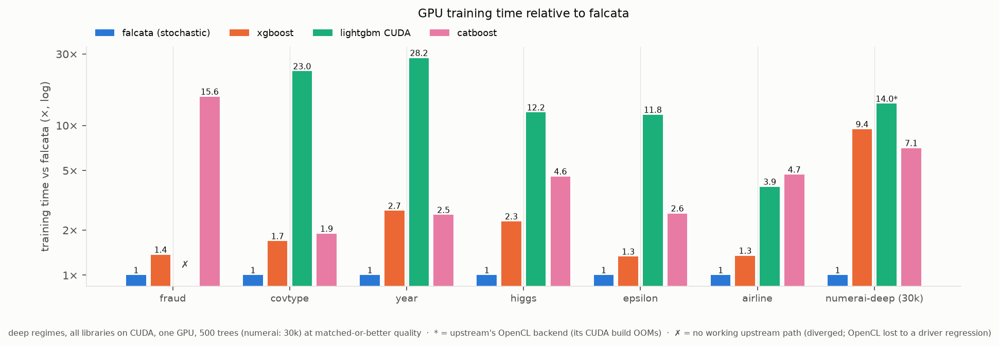
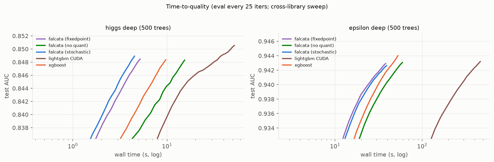
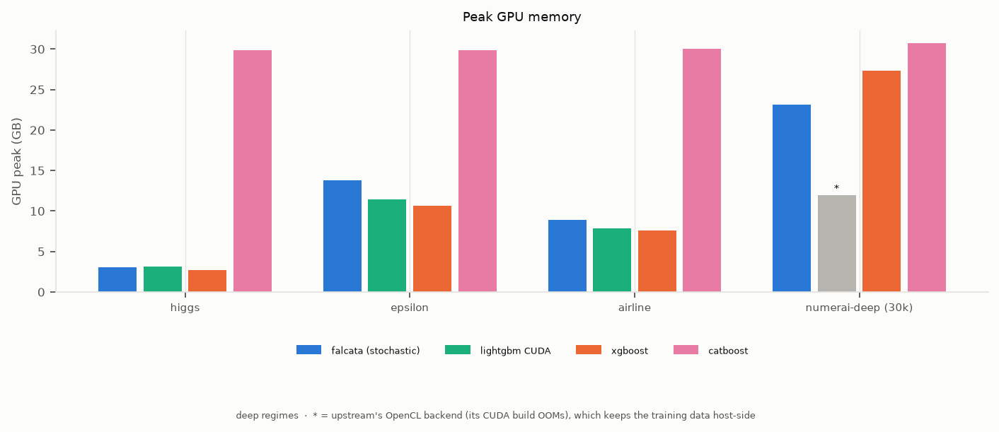
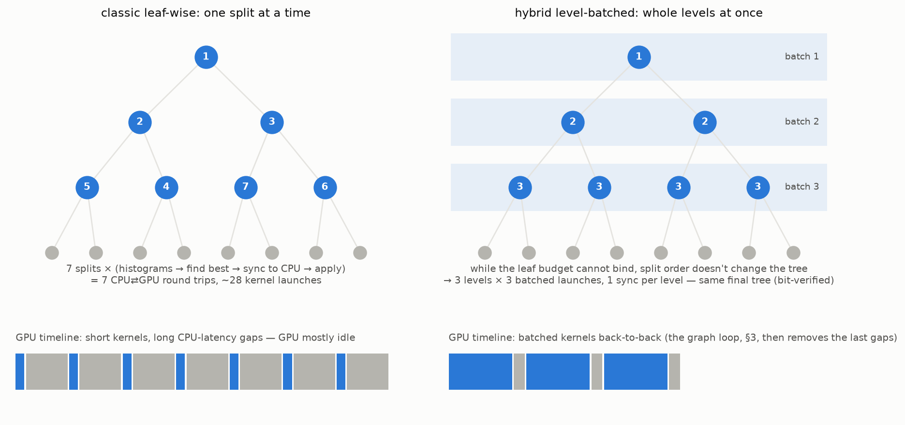
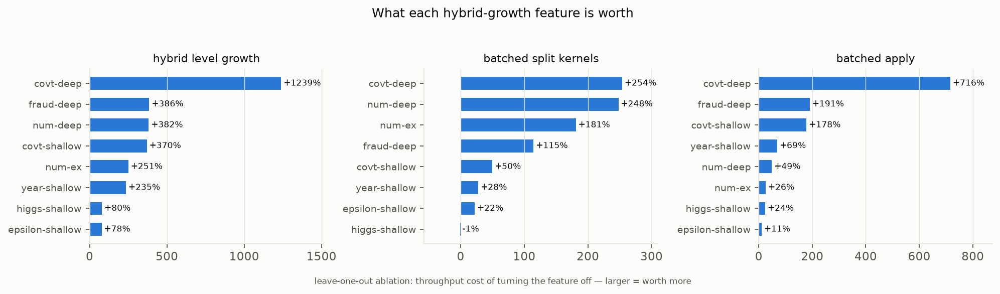
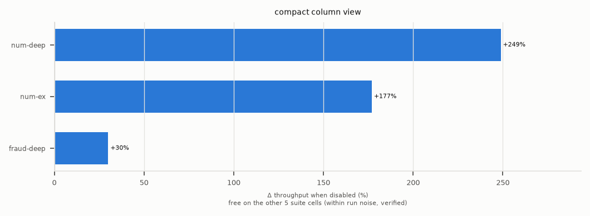
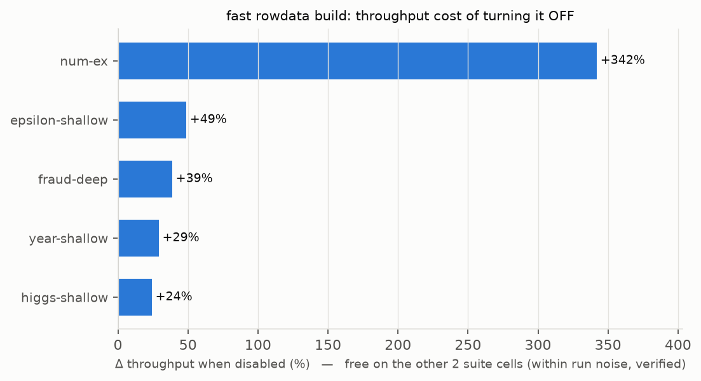
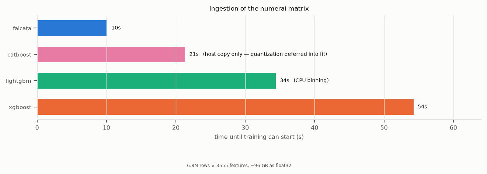
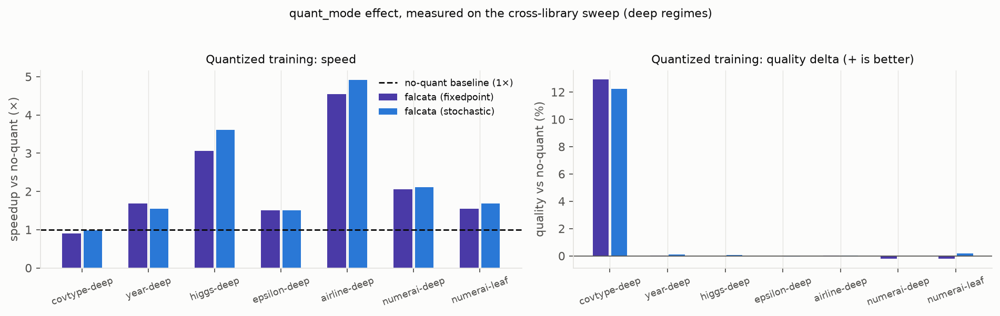
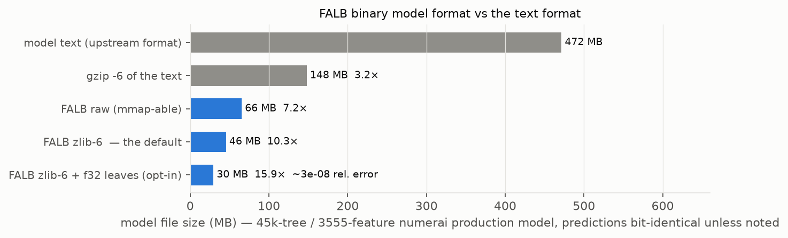

# What makes Falcata fast — and how we know

This is the verbose companion to the README's feature bullets: each landed
optimization explained for readers who do not live inside CUDA, with the
measured gains that justify it. The evidence comes from two instruments:

- **Leave-one-out ablation** (`benchmarks/ablation.py`): train with the full
  auto plan, then turn each feature off one at a time and measure how much
  slower training gets. "+300%" below means *turning the feature off makes
  training 4× slower* — i.e. the feature is worth 4×. Because every
  mechanical feature is required to produce bit-identical models, the
  ablation doubles as a correctness gate. Raw data: the newest
  `benchmarks/ablation_*.txt` battery.
- **The cross-library benchmark suite** (`~ benchmarks/README.md`): Falcata
  vs upstream LightGBM, XGBoost, and CatBoost on the gbm-bench datasets plus
  the real numerai workload (603 recorded runs, medians of 3 where
  affordable).

The plots throughout are rendered from those two measured sources by
[perf-plots/generate.py](perf-plots/generate.py) — regenerate after a new
sweep with `python docs/perf-plots/generate.py`. Exact provenance for
every number — hardware, dataset builds, and the measured commit — is
recorded in this file's git history and the benchmark workspace notes, not
repeated here.

Failed ideas are deliberately NOT here — they live in
[perf-dead-ends.md](perf-dead-ends.md). Open ideas live in
[../ROADMAP.md](../ROADMAP.md).

Datasets referenced below: **covtype** (581k×54, 7-class), **year** (515k×90
regression), **fraud** (285k×28, imbalanced binary), **higgs** (11M×28
binary), **epsilon** (500k×2000 binary), **airline** (115M×13 binary),
**numerai** (6.8M×3555 int8 regression, the production workload).

Every benchmark cell is one of five **regimes** — the exact training
configuration behind shorthand like "deep" or "30k trees":

| regime | trees | learning rate | leaves / depth | extras |
|---|---|---|---|---|
| shallow | 500 | 0.1 | 63 / 6 | gbm-bench convention, `max_bin` 255 |
| deep | 500 | 0.1 | 1023 / 10 | gbm-bench convention, `max_bin` 255 |
| numerai example | 2 000 | 0.01 | 32 / 5 | `colsample_bytree` 0.1 |
| numerai deep | 30 000 | 0.001 | 1024 / 10 | `colsample_bytree` 0.1, `min_data_in_leaf` 10k |
| numerai leaf | 30 000 | 0.001 | 1024 / unbounded | `colsample_bytree` 0.1, `min_data_in_leaf` 1k — leaf-wise growth where the 1024-leaf budget binds (maps to lossguide on XGBoost/CatBoost) |

Both numerai regimes are Numerai's own published example models, taken
unchanged from [numerai/example-scripts](https://github.com/numerai/example-scripts)
so the configuration is reproducible and not tuned to favour any library here.

The two 30k-tree regimes are single timed runs (repeats are unaffordable at
2–3 h per competitor cell); everything else is a median of 3.

---

## 1. The scoreboard: Falcata vs LightGBM, XGBoost, CatBoost

**2.4× faster than XGBoost. 14× faster than LightGBM. 4.7× faster than
CatBoost.** All libraries training on the same GPU via CUDA; geometric mean
over the seven deep workloads at matched-or-better held-out quality — and
falcata is the fastest library on every single one of them:

How it was measured: the full cross-library sweep — one GPU, aligned
hyperparameters (gbm-bench convention), medians of 3 timed runs where
affordable, every failure recorded rather than averaged away. Falcata's `quant_mode` is a user-facing dial, so each
comparison quotes the variant that matches or beats the competitor's
quality — the speedup is never bought with quality the user wouldn't
accept.

**The flagship workload — numerai (6.8M×3555; regimes as defined in the
intro table):**

| regime | falcata (stoch) | XGBoost | CatBoost | upstream LightGBM |
|---|---|---|---|---|
| example | **31 s**, corr .0194 | 286 s (9.2×), .0197 | 112 s (3.6×), .0180 | CUDA OOM; OCL broken¹ |
| deep | **12.4 min**, corr .0238 | 1 h 57 m (9.4×), .0235 | 1 h 27 m² (7.1×), .0217 | CUDA OOM; OCL 2 h 53 m (14×), .0238 |
| leaf | **30 min**, corr .0201 | 2 h 48 m (5.6×), .0201 | CUDA-702² | CUDA OOM |

¹ a display-driver update broke upstream's OpenCL path on this dataset
shape (error −9999); its one working numerai-deep run is quoted where it
exists.
² CatBoost's 30k-round cells die to the desktop display watchdog (CUDA 702);
the deep number is a successful retry, the leaf retry died again.

**Classic gbm-bench datasets, deep regime** (best sane falcata mode vs each
competitor; quality in parentheses):

| dataset | falcata | vs XGBoost | vs upstream LightGBM (CUDA) | vs CatBoost |
|---|---|---|---|---|
| fraud (fixed) | 0.6 s, AUC .9846 | 1.2× (.9747) | diverged³ | 10.5× (.9785) |
| covtype (fixed) | 5.7 s, acc .971 | 1.5× (.963) | 21× (acc .535³) | 1.7× (.918) |
| year (fixed) | 2.0 s, RMSE 8.97 | 2.9× (9.01) | 30× (9.03) | 2.7× (8.93⁴) |
| higgs (stoch) | 4.2 s, AUC .8489 | 2.3× (.8484) | 12× (.8505⁵) | 4.6× (.8373) |
| epsilon (fixed) | 39 s, AUC .9429 | 1.3× (.9440) | 12× (.9432) | 2.6× (.9507⁴) |
| airline (stoch) | 30 s, AUC .8640 | 1.3× (.8633) | 3.9× (.8782⁵) | 4.7× (.8223) |

³ upstream's CUDA learner produced diverged/garbage models on those cells.
⁴ CatBoost reaches slightly better quality on year/epsilon at 2.6–2.7× the
time — the honest trade; falcata-noquant closes most of the year gap.
⁵ upstream's higher AUC here is its `max_depth` bug: its CUDA learner does
not enforce the depth cap (measured depth 14.7 avg / 20 max under
`max_depth=6`), so those cells train much bigger trees than configured. At
equal semantics falcata matches it to the 5th decimal (see ROADMAP,
upstream-bugs).

**Time-to-quality** — the whole quality-vs-time frontier, not just endpoints
(falcata reaches every intermediate quality level first on both):

**Resources** — falcata's 4-bit rowdata + compact view keep it the smallest
or tied-smallest footprint of the CUDA libraries, where CatBoost
pre-allocates the whole card. (The asterisked OpenCL bar is smaller only
because that backend keeps the training data host-side — the same reason
it is 14× slower):

**Competitor failure ledger** (all recorded per-cell in the benchmark
report): upstream LightGBM 4.7.0's CUDA backend OOMs on every numerai
regime, diverges on fraud-deep, and produces a garbage covtype-deep model;
its quantized mode is 0-for-sweep (CUDA crashes on higgs/airline, invalid
models elsewhere); its OpenCL fallback lost most datasets to a
display-driver regression. CatBoost's 30k-round cells fight the display watchdog (CUDA
702). Falcata's own airline fixedpoint cells run at the auto-clamped 23
bins — the int32 histogram guard bounds the bin count on 92M rows (§6).

---

The rest of this document explains where that speed comes from, one
feature at a time.

## 2. Hybrid level-batched growth — the biggest single win

**The problem.** A leaf-wise GBDT learner classically grows a tree one split
at a time: build histograms for one leaf, find its best split, tell the CPU,
apply the split, repeat. On a GPU each of those steps is a separate kernel
launch plus a CPU⇄GPU synchronization. The GPU spends most of its time
waiting for the next tiny instruction rather than computing — the loop is
*latency-bound*.

**The idea.** While the leaf budget cannot yet bind, every profitable leaf
will eventually be split anyway — so the ORDER of splits doesn't change the
final tree. Falcata therefore grows whole *levels* of sibling pairs at once:
one batched histogram pass, one batched split search, one batched apply per
level. Dozens of launches and syncs collapse into three. The resulting tree
is provably identical to the leaf-wise tree (and the ablation verifies the
models match).

**Measured (leave-one-out ablation, "what turning it off costs"; values
within ±5% are run-to-run noise):**

| covtype-deep | fraud-deep | numerai-deep | covtype-shallow | numerai-example | year | higgs | epsilon |
|---|---|---|---|---|---|---|---|
| +1239% | +386% | +382% | +370% | +251% | +235% | +80% | +78% |

Deep trees benefit most (more levels, more launches saved); higgs least (its
huge rows make each kernel long enough that launch latency matters less).

Two sub-features extend the same idea:

- **Batched split kernels (`batch_kernels`)** — one find/sync launch per
  level instead of per pair: +254% covtype-deep, +248% numerai-deep, +181%
  numerai-example, +115% fraud-deep, +28–50% year/covtype-shallow.
- **Batched apply (`batch_apply`)** — the split-application phase batched the
  same way: +716% covtype-deep, +178% covtype-shallow, +191% fraud-deep,
  +69% year, +49% numerai-deep. (The batched path numbers new leaves
  level-wise, the per-split fallback in split order — equivalent trees,
  verified prediction-bit-identical, but different file md5; the ablation
  classifies it as a renumber key.)
- **Selective grow-then-prune (`selective`)** and the **speculative one-sync
  pipeline (`one_sync`)** extend level batching to budget-limited and
  non-quantized configurations; on shapes where they don't apply they cost
  nothing (±2% noise in every cell), which is exactly why they can default on.

## 3. CUDA-graph level loops (`graph_loop`)

**The problem.** Even batched, each level's launch sequence is issued by the
CPU. For shallow trees the levels are so short that CPU launch overhead
returns.

**The idea.** CUDA lets you record a sequence of kernel launches once (a
"graph") and replay it from the device itself. Falcata captures the per-level
sequence and lets a device-side controller replay it, removing the CPU from
the inner loop entirely.

**Measured (leave-one-out ablation):** nothing clears the noise floor. The
largest readings are +9.3% on covtype-deep and +4.5% on both numerai cells,
against noise bands of 12% and 5% respectively (§8 methodology note) — every
other cell is inside ±2%. The direction is consistently positive on the big
cells, which is what you would expect from a real but small effect, but this
suite cannot resolve it, so no number here is quotable and the section carries
no plot.

The graph's job today is simply smaller than when it landed: the one-sync and
batched flows already removed most of the host round-trips it was built to
hide. It stays on because it is free where it doesn't help, and the planner
picks per shape.

## 4. Per-tree compact column view (`compact_quant`)

**The problem.** With `feature_fraction < 1`, each tree randomly samples a
subset of columns. But the bin matrix is row-major: even if a tree uses 10%
of the columns, reading a row drags the other 90% through the memory system,
because unused columns share the same cache lines.

**The idea.** Once per tree, gather ONLY the sampled columns into a dense
"compact" matrix. Histogram passes then read purely useful bytes. The gather
costs one pass; the histogram kernels run 11+ passes per tree over the
result.

**Measured (leave-one-out ablation):** +249% on numerai-deep, +177% on
numerai-example — the two feature-sampled workloads; neutral elsewhere (it
only activates when sampling is on). The win scales with the excluded
fraction: ~3.4× at `feature_fraction=0.1`, tapering to ~1.1× at 0.6.

## 5. GPU-native ingestion (`gpu_construct`, `fast_rowdata`, `efb_precheck`, `rowdata_4bit`)

**The problem.** Before training starts, raw features must be binned and laid
out for the GPU. Upstream does this on the CPU, then uploads — minutes of
setup for large datasets (numerai Booster creation was 13.9s even after
earlier fixes; originally far worse).

**The ideas.**
- **`gpu_construct`**: dense binning runs on the device; CuPy /
  `__cuda_array_interface__` inputs never round-trip through host memory.
- **`fast_rowdata`**: build the row-major training matrix directly from
  column bins, skipping the CPU multi-value-bin machinery: +342% on
  numerai-example, +49% epsilon, +39% fraud-deep, +29% year, +24% higgs
  (throughput effect via construct-time inclusion).

  
- **`efb_precheck`**: a cheap density check that skips Exclusive Feature
  Bundling's ~7.7s no-op search on provably-unbundlable dense data.
- **`rowdata_4bit`**: datasets whose features all fit 16 bins store two
  values per byte, halving the training matrix (numerai: 19GB → 9.5GB on the
  current cache) and the bytes every kernel reads.

What it buys on the workload ingestion was built for — the numerai matrix,
the largest in the suite (GPU ingestion is a bandwidth play, so this is
where the effect lives; on sub-GB datasets all libraries construct in
under a second and the comparison is noise):

Upstream LightGBM's `Dataset` construction is CPU binning regardless of
training backend — 3.4× slower than our GPU-native construct. Catboost's
low bar is partly an accounting artifact — its Pool build is a host copy,
with quantization deferred into `fit()` where it lands in the train timer.

## 6. Quantized training: `quant_mode` (the speed/quality dial)

**The problem.** Histogram accumulation is the hot loop, and accumulating
double-precision gradient/hessian pairs is memory-heavy.

**The idea.** Quantize gradients to small integers (a published technique —
see the NeurIPS'22 reference in the README) and accumulate integers instead.
Falcata ships two modes: `stochastic` (seeded stochastic rounding — the
aggressive end) and `fixedpoint` (deterministic rounding with an
outlier-robust gradient scale — the near-lossless end). Bin count is the
`quant_bins` dial for both modes (defaults: 4 stochastic, 64 fixedpoint;
any value in [2, 65534]). Both are
bit-reproducible — run to run, across GPU models, and across host
machines: stochastic rounding noise is Philox-generated in-kernel as a pure
function of (seed, tree, row) — an idea borrowed from XGBoost 3.3's Philox
sampling — so machine-independence holds by construction (no tables; also
freed 8 bytes/row of VRAM and their per-tree reads, worth ~+4% on
numerai-deep). Integer atomics make results order-invariant, which is what
lets the md5 regression gates exist and makes them portable to any machine
(cross-arch verified sm_89 vs sm_120 on the table-era build; Philox is pure
integer math and inherits the guarantee).

**Measured (cross-library sweep, numerai-deep regime):**

| mode | train | trees/s | holdout corr | sharpe |
|---|---|---|---|---|
| stochastic | 12.4 min | 40.4 | 0.0238 | 1.407 |
| fixedpoint | 12.7 min | 39.3 | 0.0237 | 1.405 |
| none | 26.1 min | 19.2 | 0.0238 | 1.402 |

2× the speed of full precision at equal quality. The outlier-robust scale is
what makes fixedpoint safe on imbalanced data: without it, fraud/deep AUC
drops 0.9825 → 0.8001. Across every deep cell of the sweep:

The suite exposed one real stochastic defect, since fixed: at a flat
4-bin auto default, big datasets driving many small leaves
(year/epsilon deep, ~400 rows/leaf) *declined* in test quality
mid-training — the trees were fitting rounding noise (year-deep peaked at
iteration 75, then lost +4.9 MSE). The rounding scheme was innocent
(stochastic@64 exactly matches fixedpoint@64); the resolution was simply
too coarse for small per-leaf sums. The stochastic auto
default therefore raises itself to 64 bins (constant-hessian) / 16 (others) when
`num_data ≥ 100k` and expected rows/leaf < 4096 — measured drift now +0.17
MSE / 0.0000 AUC, at fixedpoint's cost on those shapes and no change
anywhere else. Two deliberate exclusions, both measured: small datasets
keep 4 bins (there the rounding noise is regularization and finer bins
hurt), and ≥50:1-imbalanced binary keeps 4 bins (fraud-deep measured AUC
.956@4 → .870@16 — the no-robust-scale failure mode; use fixedpoint for
imbalanced data, its robust scale is built for exactly this).

Bin count is also bounded above by the int32 histogram guard
(`num_data × bins < 2^31`, the hessian lane is binding): the fixedpoint
*auto* default clamps itself to the dataset-safe ceiling
with a warning (airline's 92M rows → 23 bins) instead of refusing; an
explicitly-set unsafe `quant_bins` still fails loudly rather than silently
wrap.

## 7. Precision modes (`cuda_precision=fp32`)

For NON-quantized training, storing global histograms as float pairs instead
of double pairs halves their bandwidth. Measured per-tree wins at
equal-or-better quality: epsilon-deep −36% time, year −18%, covtype −16%,
fraud-deep −14%, higgs-deep −12%; numerai neutral (sampling-dominated).
Quality-gated rather than bit-identical, hence a config parameter and not a
plan key.

A second, separately-measured mechanism: on DEEP trees the
histogram pool halves from ~248MB (doesn't fit the 5090's 96MB L2) to
~124MB (mostly fits), so subtraction's parent-histogram re-reads start
hitting cache. Isolated on covtype non-quant: fp32 gains **+26% deep** vs
+1.7% shallow — the cache cliff, not bandwidth, dominates the deep win.
Practical guidance: on deep non-quantized configs, `cuda_precision=fp32` is
the single highest-leverage switch available.

## 8. Memory-layout micro-optimizations (each small, all free)

- **`gh_interleave`** — gradient and hessian interleaved as one float2 so a
  row costs one scattered 32-byte read instead of two: +21% numerai-deep.
- **`split_packed_read`** — split kernels read the 4-bit packed matrix
  directly instead of materializing a ~1.5GB per-tree column copy: +12%
  numerai-deep.
- **`batch_reghist`** — for ≤8-bin datasets, accumulate a thread's rows in
  registers and flush once instead of two shared-memory atomics per row.
- **`batch_wide`** — wide-shape batched search for many-column datasets
  (+9.9% on epsilon in the smoke ablation), plus wide leaf-splits init
  batching.
- **`small_leaf_construct`** — a cheaper construct body for very small
  leaves. Extended to quantized training: when a deep level's
  largest sibling pair is under 1024 rows, a dedicated kernel adds packed
  integer gradients straight to the global histogram — the shared-memory
  zero + sync + merge (whose cost is proportional to partition *bins*, not
  rows) is skipped entirely: **+11.2% covtype-deep**, neutral on numerai
  (its 10k-row min-leaf never triggers it). Bit-identical by integer
  order-invariance — unlike the float direct body, which remains permanently
  disabled. Kept as a separate kernel deliberately: an in-kernel branch
  version cost the never-taken numerai path measurable register pressure.

Four more (measured in a dedicated battery; all
bit-identical in every cell):

- **`wide_partitions`** — on datasets wider than 504 columns, each construct
  thread handles two columns, halving the partition count and its per-partition
  zero/merge overhead: **+8.8% numerai-deep**; mechanically inert on narrower
  data.
- **`l2_policy`** — pins the gradient/hessian and data-index buffers into a
  persisting L2 window so each level's bin-matrix stream stops evicting them
  (the construct kernel is latency-bound on exactly those scattered re-reads):
  +2.8% numerai-deep and covtype-deep at the original fixed 64MB carve-out,
  improved to **+5.3%** once the carve-out was sized to the buffer actually
  pinned (device-proportional sizing — a fixed carve
  stranded 42MB of L2 the streaming reads could have used); neutral on year
  at real run lengths. Its companion: bin-matrix loads are marked
  **evict-first** (`__ldcs`) since bin bytes have no intra-level reuse —
  deprioritizing them frees L2 for histogram-subtraction re-reads: +8%
  covtype-deep, +10% year via the dense-path loads, and **+9.7%
  numerai-deep** once extended to the compact-view pack-codec reads (the
  per-tree compact matrix re-reads 11+ passes/level against a 96MB L2 —
  streaming priority stops it evicting the pinned gradient window).
  (Prediction inverted by measurement: the win is largest on the "already
  L2-resident" shapes.)
- **`colmajor_fill`** — a one-time column-major copy of the packed bin matrix
  serves as the compact-fill gather source, so the per-tree fill reads
  contiguous columns instead of dragging ~10× its bytes through row-major
  cache lines: +2.2% numerai-deep (the fill is genuinely bandwidth-bound, but
  it is a small slice of tree time — the +14% pre-measurement estimate did not
  survive contact with the profiler). VRAM-gated by the planner.
- **`tuner`** — a per-tree bandit over behavior-preserving execution knobs,
  best-of-15 timing, re-probe every 3000 trees: +2.1% numerai-deep, +2.7%
  year from the saturation-floor knob alone. Quantized training only —
  integer histograms make the model schedule-invariant, so retuning cannot
  change results. Under `auto` it engages only at ≥300 rounds;
  `cuda_plan=auto,tuner:on` forces it. Extended into the full
  three-tier stack: **tier-0** seeds the candidate sets from the device
  (floor candidates scale with SM count relative to the 5090 they were tuned
  on); **tier-1** runs coordinate descent over two knobs (saturation floor
  with an elastic bracket, and the quant small-leaf row threshold); and
  **tier-3** persists the chosen values per (shape, device) signature to
  `~/.cache/falcata/wisdom.txt` — retrains of the same workload skip the
  ~130-tree probe phase and start at the known-best point (measured: +3% on
  a numerai-deep 300-round retrain, covtype-deep 83.8 → 88.2 t/s), while the
  periodic re-probe still verifies the cached choice against reality. (A
  histogram-pipeline-count knob was considered and rejected: it only affects
  the per-pair fallback path — the batched flow every real workload uses
  runs on a single stream.)

All four compose: **+10.5% on numerai-deep combined**. A methodology note the
battery re-taught us: 100-round probe cells on fast datasets (year runs 0.4s)
sit inside clock/thermal noise — the year "regressions" the battery first
reported all vanished under interleaved A/B at 500 rounds.

The ablation shows each of these within noise on shapes they don't target —
the planner's "default on, individually ablatable" contract in action.

## 8b. Runtime-JIT construct kernels (`construct_jit`)

The NVRTC infrastructure (shape-keyed compile cache, AOT fallback,
self-test-then-promote) serves ALL mask-free quantized dense shapes, not just
the compact view. The specialized kernel strips the runtime branches the AOT
kernel must carry (feature/bin masks, graph state, speculative sizing,
wide-partition predication) — on an issue-bound kernel those branches are the
remaining fat. It is bit-identical everywhere; the canonical 700-round locks
reproduce exactly with the JIT live.

**Measured (leave-one-out ablation):** small single-digit effects on the
big cells — numerai-deep sits inside run-to-run noise (consecutive
measurements: +8.4% and +0.3%). The one above-noise reading, fraud-deep
+48%, is a sub-second cell — too swingy to quote as precise (§8 methodology
note), which is also why this section carries no plot: the honest chart
would show a single bar of exactly that number.

The original numerai win required syncing the JIT template with the
evict-first (`__ldcs`) loads first — an unsynced template measured at
parity, which earlier led to a premature dead-end verdict (since
corrected). Default ON
for quantized runs of ≥300 rounds (the ~230ms one-time compile+self-test
amortizes); `construct_jit:on` forces it, unsupported shapes (graph capture,
speculative levels, masked trees, wide partitions) fall back to AOT
automatically.

## 9. GPU inference via NVIDIA FIL

`Booster.predict()` on a CUDA-trained model routes through cuML's Forest
Inference Library when available: numerai predict 0.90s → **0.046s** (CuPy
in/out), higgs 0.37s → 0.004s. See the README for precision notes and the
opt-out.

## 9b. Model size: the FALB binary format

**The problem.** The upstream text model format is enormous — a 45k-tree
numerai production model is 471.6 MB of ASCII, and even gzip only takes it
to 148 MB, because numbers-as-text compress poorly and the leaf values are
f64 noise to an entropy coder.

**The idea.** A sectioned binary container: typed
arrays instead of text, zlib-6 per section, a byte-plane shuffle before
compression so the coder sees the near-constant high-order bytes first
(worth ~4 MB alone), and thresholds stored as per-feature dictionaries of
the distinct doubles. zlib over zstd deliberately: it links dynamically
everywhere including rentals, and zstd's ~5–10% edge isn't worth a build
dependency.

**Measured (real production artifact, 45k trees × 3555 features):**

The default is **10.3×** smaller than the text format with **bit-identical
predictions** and a faster load (0.188 s → 0.160 s); gzip-of-text manages
only 3.2×. The remaining lever is the f64 leaf-value array (54.8% of the
raw file, incompressible at 1.15× even shuffled) — hence the opt-in f32
leaves at 15.9× for ~3e-08 relative error, the one knob that trades
exactness. The format reserves `leaf_dim` and dtype tags per array so
vector leaves (multi-target) and new precisions arrive without a v2.

## 10. Categorical features on the hybrid fast paths

Categorical datasets previously fell back to the classic one-split-at-a-time
loop for every hybrid stage, and quantized training refused them outright.
Four pieces lifted the whole class:

- **Batched apply** (1a): variable-length categorical bitsets travel through
  the fixed-size batched split inputs via a per-level side-band INNER-bitset
  arena in the data partition. The arena-build kernel constructs bitsets and
  patches most-frequent-bin default directions on device, removing the
  classic flow's three per-split D2H round trips. Tree recording interleaves
  per-split categorical recording with numerical SplitBatch chunks.
- **Selective (grow-then-prune) flow** (1b): applied-record snapshots of the
  inner threshold bins (the finder's per-leaf slab is recycled before
  finalize) plus a categorical replay branch in RebuildFromHostSplits with
  host-built bitsets. Selective vs classic produces identical structure and
  categorical bitsets (leaf-value fp noise only, same class as numerical).
- **Quantized training** (2a): the categorical search runs its per-bin math
  in double either way, so one reader-templatized body serves both
  pipelines; quantized readers unpack the packed int32/int64 integer bins
  per bin (exact) and the writers fill the packed int64 child totals the
  quantized pipeline seeds child leaves from. fixedpoint-vs-none rmse delta
  at 200k rows with card-3 + card-120 categoricals: 0.198356 vs 0.198346.
- **Batched level kernels** (2b): both level find kernels (non-quantized and
  discretized) run the categorical body per (task, pair, role) block; the
  per-slot categorical-threshold slabs grow with the level output buffer.

Measured (400k rows x (5 numeric + card-3 + card-150 categorical),
63 leaves, 200 rounds, identical rmse and categorical split counts across
all flows):

| flow | train time |
|---|---|
| classic loop | 1.76s |
| hybrid, per-pair fallback (after 1b) | 1.45s |
| hybrid, batched level kernels (after 2b) | **0.48s (3.7x)** |

Still excluded for categoricals: the one-sync speculative prefix and the
graph loop (two-sync batched carries the win); >256-category features use
the 255 most frequent categories per split on the shared-memory finder
(Init warns) because upstream never wrote a global-memory discretized
finder. Open items tracked on the ROADMAP.

---

## 11. Batched-apply partition overhaul: deferred leaf map + flat-grid kernels

Profiling the 92M-row airline-cat deep regime (1023 leaves, depth 10) showed
the level-batched apply's partition kernels at 77% of GPU time -- the
data-partition-memory-bound class first profiled on higgs. Two structural
fixes, both bit-parity (canonical md5 locks reproduce identically):

- **Deferred row->leaf map.** The gen-bit-vector kernel wrote
  `data_index_to_leaf_index` for every row at every level: a 4-byte random
  scatter, one full DRAM sector per row, ~55% of the kernel's traffic at deep
  levels. Every consumer of the map is a tree-end operation, so it is now
  written once per tree by `MaterializeLeafMapKernel` from the final leaf
  windows (the selective flow materializes from the final classic layout,
  replacing its remap).
- **Flat-grid apply kernels.** The 2D `(largest leaf's blocks x num_splits)`
  grid is mostly empty blocks at skewed deep levels (millions per launch).
  Host-launched levels now run a 1D grid-stride loop over the level's real
  chunk count with a binary-searched `(descriptor, local block)` mapping
  (`flat_block_start` prefix in the descriptor). The graph-captured device
  loop keeps the controller-resized 2D form.

Airline-cat, 500 rounds (xgboost native-categorical as reference):

| regime | falcata-noquant | falcata-stoch | xgboost |
|---|---|---|---|
| deep (1023 leaves) | 95.1s -> **47.0s** | 93.4s -> **41.7s** | 43.8s |
| shallow (63 leaves) | 28.7s -> **23.5s** | 26.8s -> **20.5s** | 22.8s |

Per-level partition cost fell from ~17.4ms to ~2.2ms. A second round
removed the next three bottlenecks: the interleaved categorical
recording ran ~6 launches + TWO blocking length readbacks per categorical
split (~432/deep tree -- also the source of +-2.3s run-to-run jitter), now
ONE batched bitset kernel + ONE readback per level; the known-final level
writes the row->leaf map inline in split-inner (with explicit leaf-cache
invalidation for its never-searched children -- the subtle correctness pair
the lattice fingerprints caught) and skips a wasted next-level search; and
the one-sync prefix admits categorical datasets. A third pass replaced the
gen/aggregate byte hand-off with packed ballot bits.

**Official numbers** (FAIR interleaved protocol: quiet
desktop, per regime one warmup round-robin then 3 timed rounds with the four
engines interleaved per round — earlier mixed-condition numbers had up to
+-10% desktop-GPU-contention noise, spreads now 0.0-0.5% shallow / 2.5-9.8%
deep; catboost from the prior pass, not re-run at 925.6s/1838.3s):

| regime | falcata-stoch | falcata-noquant | xgboost | lightgbm CUDA | margin vs best other |
|---|---|---|---|---|---|
| shallow | **18.8s** | 20.4s | 22.6s | 35.4s | **19.8% faster** |
| deep | **33.9s** | 36.7s | 44.8s | 144.6s | **31.9% faster** |

Time-to-quality (report/aircat_time_to_quality.png in the bench workspace;
curve cells + extended falcata runs): falcata-stoch rides the top envelope at
small budgets (shallow @10s: 0.8224 vs xgboost 0.8206 vs lightgbm 0.8072;
deep @33s: 0.8675 vs 0.8661 vs 0.8565) and at large budgets it passes every
competitor's TERMINAL quality -- deep 0.8852 @154s vs lightgbm's 0.8837
there, 0.8873 @210s beyond lightgbm's 0.8863 endpoint; shallow 0.8541 @72s
vs their 0.850/0.845 bests. In a narrow band around xgboost's own endpoint
it is tied-to-slightly-ahead (within ~0.004) before its curve stops. The
upstream-lightgbm AUC outlier at fixed rounds is
its CUDA deviating from its own CPU spec (inflated split gains, first-tree
divergence analysis; our engine matches lightgbm-CPU node for node) -- at
equal wall time the outlier disappears.

---

## Multi-GPU: level-batched NCCL all-reduce

The classic data-parallel path all-reduces one leaf histogram per split
(~254 collectives for a 255-leaf tree at ~190us each on 2x3090). Multi-GPU
now rides the hybrid two-sync flow, whose per-level structure allows ONE
grouped collective per level: gather every pair's smaller-leaf histogram
into a contiguous staging buffer (through the colsample-aware used-bin
index when active), reduce once, scatter back, then run the deferred
fix/subtract on the globally reduced histograms.

Measured on a rented dual-GPU box (PCIe, host-staged transport), 4M x 400
int8 `max_bin=5`, 200 trees, `min_data_in_leaf=20k`, depth 11:

| arm | time | trees/s | rmse |
|---|---|---|---|
| 1 GPU (hybrid) | 6.86 s | 29.2 | 0.149124 |
| 2 GPU level-batched | 10.09 s | 19.8 | 0.149141 |
| 2 GPU per-split (classic) | 15.54 s | 12.9 | 0.149138 |

Level batching is **1.54x faster than the per-split reduce** and produces
structurally identical trees to single-GPU (81 leaves, same features and
gains for the first 3 trees; rmse delta is fp32 reduce-order noise). It is
the multi-GPU default wherever the two-sync flow is usable; one-sync,
graph and selective flows remain single-GPU.

Correctness notes for future multi-GPU work: `NCCLTopology` silently
clamps `num_gpu` to the visible device count, so a 2-rank test on a
1-GPU box is a single-rank no-op — multi-rank semantics can only be
tested on real multi-GPU hardware. The canonical count-leak failure
class: struct `num_data_in_leaf` is rank-LOCAL under NCCL, while desc
counts and histogram sums are GLOBAL.
`FALCATA_DEBUG=dump` now prints per-level reduce totals, leaf-cache
entries and bookkeeping counts on NCCL runs — the instrumentation that
located both bugs.
