# What makes Falcata fast — and how we know

**2.4× faster than XGBoost. 14× faster than LightGBM. 4.7× faster than
CatBoost.** All libraries training on the same GPU via CUDA; geometric mean
over the seven deep workloads at matched-or-better held-out quality — and
falcata is the fastest library on every single one of them:

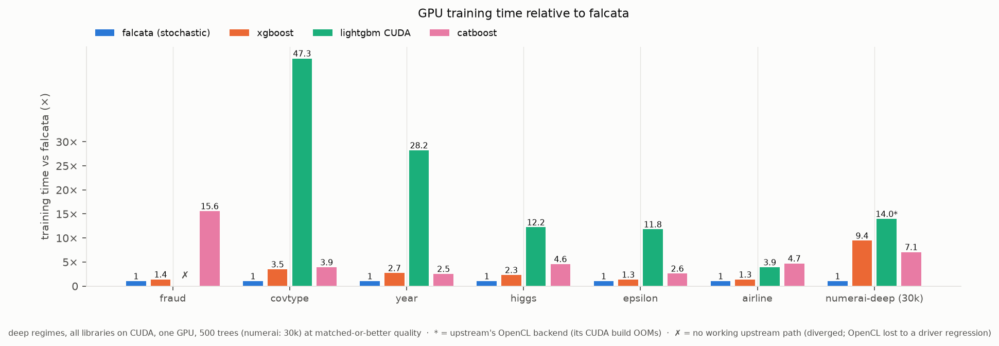

Falcata's `quant_mode` is a user-facing dial, so every comparison below quotes
the variant that matches or beats the competitor's quality — the speedup is
never bought with quality the user wouldn't accept. Method, regimes and
reproduction steps: [How this was measured](#how-this-was-measured).

**The flagship workload — numerai (6.8M×3555; regimes defined under
[How this was measured](#how-this-was-measured)):**

| regime | falcata (stoch) | XGBoost | CatBoost | upstream LightGBM |
|---|---|---|---|---|
| example | **31 s**, corr .0194 | 286 s (9.2×), .0197 | 112 s (3.6×), .0180 | CUDA OOM; OCL broken¹ |
| deep | **12.4 min**, corr .0238 | 1 h 57 m (9.4×), .0235 | 1 h 27 m² (7.1×), .0217 | CUDA OOM; OCL 2 h 53 m (14×), .0238 |
| leaf | **30 min**, corr .0201 | 2 h 48 m (5.6×), .0201 | CUDA-702² | CUDA OOM |

¹ a display-driver update broke upstream's OpenCL path on this dataset
shape (error −9999); its one working numerai-deep run is quoted where it
exists.
² CatBoost's 30k-round cells die to the desktop display watchdog (CUDA 702);
the deep number is a successful retry, the leaf retry died again.

**Classic gbm-bench datasets, deep regime** (best sane falcata mode vs each
competitor; quality in parentheses):

| dataset | falcata | vs XGBoost | vs upstream LightGBM (CUDA) | vs CatBoost |
|---|---|---|---|---|
| fraud (fixed) | 0.6 s, AUC .9846 | 1.2× (.9747) | diverged³ | 10.5× (.9785) |
| covtype (fixed) | 5.7 s, acc .971 | 1.5× (.963) | 21× (acc .535³) | 1.7× (.918) |
| year (fixed) | 2.0 s, RMSE 8.97 | 2.9× (9.01) | 30× (9.03) | 2.7× (8.93⁴) |
| higgs (stoch) | 4.2 s, AUC .8489 | 2.3× (.8484) | 12× (.8505⁵) | 4.6× (.8373) |
| epsilon (fixed) | 39 s, AUC .9429 | 1.3× (.9440) | 12× (.9432) | 2.6× (.9507⁴) |
| airline (stoch) | 30 s, AUC .8640 | 1.3× (.8633) | 3.9× (.8782⁵) | 4.7× (.8223) |

³ upstream's CUDA learner produced diverged/garbage models on those cells.
⁴ CatBoost reaches slightly better endpoint quality on year and epsilon at
2.6–2.7× the time; falcata-noquant closes most of the year gap. On epsilon,
most of CatBoost's lead is default regularization, not the algorithm: the
regimes run each engine's default L2, and CatBoost ships `l2_leaf_reg=3`
where the LightGBM family ships 0. Sweeping L2 on epsilon-deep closes the
gap from .0079 to .0015 (falcata .9499 at `lambda_l2=300` in 42 s vs
CatBoost's plateau .9514 at 109 s; XGBoost tracks falcata within .0006 at
every L2). The residual .0015 is the oblivious-tree structure itself —
CatBoost gains almost nothing from extra L2 because its level-wide shared
splits already are the constraint. Reproduce with `bench.py --set l2=N`.
⁵ upstream's higher AUC here is its `max_depth` bug: its CUDA learner does
not enforce the depth cap (measured depth 14.7 avg / 20 max under
`max_depth=6`), so those cells train much bigger trees than configured. At
equal semantics falcata matches it to the 5th decimal (see ROADMAP,
upstream-bugs).

**Time-to-quality** — the whole quality-vs-time frontier, not just endpoints
(falcata reaches every intermediate quality level first on both):

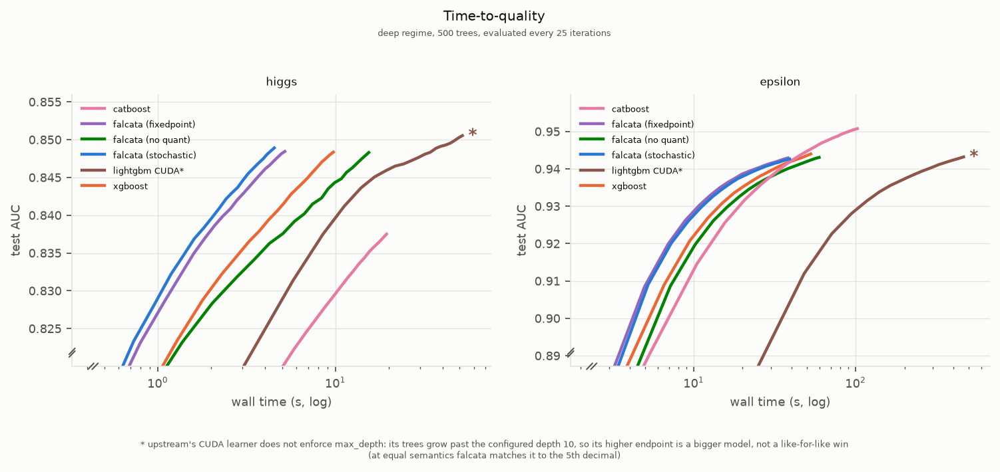

Two endpoints on this chart need reading carefully, and neither changes the
frontier claim above — reaching each quality level first is a separate
statement from where the curves stop.

*Upstream ends above falcata on higgs* (.8505 vs .8485). That is the
`max_depth` bug of footnote ⁵: the deep regime asks for 1023 leaves inside
depth 10, and upstream's CUDA learner places them wherever gain is best, so it
trains a deeper, more expressive model than the one configured — which is also
why its curve sits so far right. Given the same semantics (`max_depth=-1`)
falcata matches it to the 5th decimal at 1.7–3.7× the speed.

*XGBoost and CatBoost end above falcata on epsilon*, and that is real but
smaller than it looks: footnote ⁴ quantifies it with an L2 sweep — at matched
regularization the CatBoost lead shrinks from .0079 to .0015, the residual
being its oblivious-tree structure. It is a cross-family difference rather
than a falcata regression: `falcata-noquant` lands at .94307 against upstream
LightGBM's .94320, so the two implementations of the same algorithm agree to
1e-4, and quantization costs a further ~4e-4 (§5). The frontier claim is
about reaching each quality level first, which falcata does up to the point
where its curves end.

**Resources** — falcata's 4-bit rowdata + compact view keep it the smallest
or tied-smallest footprint of the CUDA libraries, where CatBoost
pre-allocates the whole card. (The asterisked OpenCL bar is smaller only
because that backend keeps the training data host-side — the same reason
it is 14× slower):

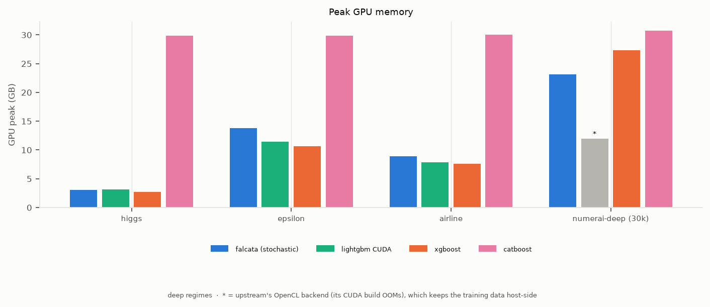

**Competitor failure ledger** (all recorded per-cell in the benchmark
report): upstream LightGBM 4.7.0's CUDA backend OOMs on every numerai
regime, diverges on fraud-deep, and produces a garbage covtype-deep model;
its quantized mode is 0-for-sweep (CUDA crashes on higgs/airline, invalid
models elsewhere); its OpenCL fallback lost most datasets to a
display-driver regression. CatBoost's 30k-round cells fight the display watchdog (CUDA
702). Falcata's own airline fixedpoint cells run at the auto-clamped 23
bins — the int32 histogram guard bounds the bin count on 92M rows (§5).

---

## How this was measured

Two instruments, both shipped in this repository:

- **The cross-library sweep** ([`benchmarks/`](../benchmarks/README.md)) —
  falcata against upstream LightGBM, XGBoost and CatBoost on the gbm-bench
  datasets plus the real numerai workload: 603 recorded runs, medians of 3
  where affordable, every failure recorded rather than averaged away.
- **Leave-one-out ablation** (`benchmarks/ablation.py`) — train with the full
  auto plan, then turn each feature off one at a time. "+300%" below means
  *turning the feature off makes training 4× slower*, i.e. the feature is worth
  4×. Because every mechanical feature is required to produce bit-identical
  models, the ablation doubles as a correctness gate. Raw data: the newest
  `benchmarks/ablation_*.txt` battery.

Datasets: **covtype** (581k×54, 7-class), **year** (515k×90 regression),
**fraud** (285k×28, imbalanced binary), **higgs** (11M×28 binary), **epsilon**
(500k×2000 binary), **airline** (115M×13 binary), **numerai** (6.8M×3555 int8
regression, the production workload).

Every cell is one of five **regimes** — the exact training configuration behind
shorthand like "deep" or "30k trees":

| regime | trees | learning rate | leaves / depth | extras |
|---|---|---|---|---|
| shallow | 500 | 0.1 | 63 / 6 | gbm-bench convention, `max_bin` 255 |
| deep | 500 | 0.1 | 1023 / 10 | gbm-bench convention, `max_bin` 255 |
| numerai example | 2 000 | 0.01 | 32 / 5 | `colsample_bytree` 0.1 |
| numerai deep | 30 000 | 0.001 | 1024 / 10 | `colsample_bytree` 0.1, `min_data_in_leaf` 10k |
| numerai leaf | 30 000 | 0.001 | 1024 / unbounded | `colsample_bytree` 0.1, `min_data_in_leaf` 1k — leaf-wise growth where the 1024-leaf budget binds (maps to lossguide on XGBoost/CatBoost) |

The numerai regimes come from Numerai, not from us, so the configuration is
public and not tuned to favour any library here. *numerai deep* is their
published `deep_lgbm_params` — the parameters behind the v5 benchmark models —
from [the Numerai docs](https://docs.numer.ai/numerai-tournament/models#deep-lgbm-params).
*numerai example* is the model in their `hello_numerai` notebook. Numerai's
own two sources disagree by one leaf here: every parameter set on the docs page
uses `num_leaves = 2**max_depth` (64 at depth 6, 1024 at depth 10), while the
notebook writes `2**5-1` = 31. We use 32 at depth 5, following the docs. *numerai leaf* is ours — the
deep parameters with the depth cap lifted, so the leaf budget is what binds.
The two 30k-tree regimes are single timed runs (repeats are unaffordable at
2–3 h per competitor cell); everything else is a median of 3.

### Reproducing any number on this page

That harness is the only copy, and it is the one that produced these numbers.
It builds the four engines into their own environments, caches every dataset as
identical float32 bits, and runs each cell in an isolated subprocess:

```bash
export FALCATA_BENCH_ROOT=/big/disk/falcata-bench   # ~200GB when fully cached
./benchmarks/setup_envs.sh                          # build all four engines
$FALCATA_BENCH_ROOT/env-competitors/bin/python benchmarks/datasets.py all
python3 benchmarks/orchestrate.py                   # resumable; --only fraud,covtype for a quick pass
python3 docs/perf-plots/generate.py                 # re-render these plots
```

Two things to know before comparing your numbers to ours. Each engine is run
on **its own default L2 leaf penalty** (they differ: 0, 1 and 3), following the
gbm-bench convention rather than aligning them — `bench.py --align-l2` does
align them and will move the quality figures. And timings need a **quiet
machine**: host contention alone moved our medians by 18–55%, which is larger
than several of the effects discussed below.

The plots are rendered from those two measured sources by
[perf-plots/generate.py](perf-plots/generate.py). Failed ideas are deliberately
not here — they live in [perf-dead-ends.md](perf-dead-ends.md); open ideas in
[../ROADMAP.md](../ROADMAP.md).

---

The rest of this document explains where that speed comes from, one feature at
a time.

## 1. Hybrid level-batched growth — the biggest single win

**The problem.** A leaf-wise GBDT learner classically grows a tree one split
at a time: build histograms for one leaf, find its best split, tell the CPU,
apply the split, repeat. On a GPU each of those steps is a separate kernel
launch plus a CPU⇄GPU synchronization. The GPU spends most of its time
waiting for the next tiny instruction rather than computing — the loop is
*latency-bound*.

**The idea.** While the leaf budget cannot yet bind, every profitable leaf
will eventually be split anyway — so the ORDER of splits doesn't change the
final tree. Falcata therefore grows whole *levels* of sibling pairs at once:
one batched histogram pass, one batched split search, one batched apply per
level. Dozens of launches and syncs collapse into three. The resulting tree
is provably identical to the leaf-wise tree (and the ablation verifies the
models match).

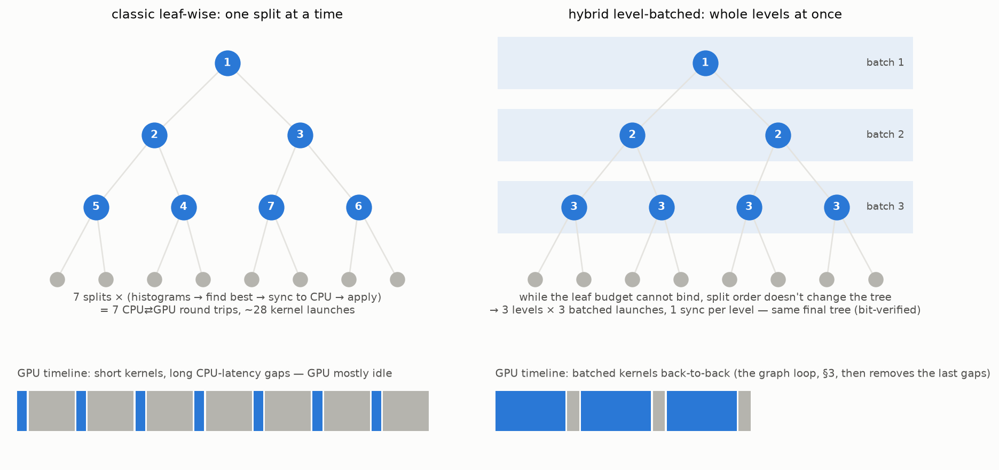

**Measured (leave-one-out ablation, "what turning it off costs"; values
within ±5% are run-to-run noise):**

| covtype-deep | fraud-deep | numerai-deep | covtype-shallow | numerai-example | year | higgs | epsilon |
|---|---|---|---|---|---|---|---|
| +1239% | +386% | +382% | +370% | +251% | +235% | +80% | +78% |

Deep trees benefit most (more levels, more launches saved); higgs least (its
huge rows make each kernel long enough that launch latency matters less).

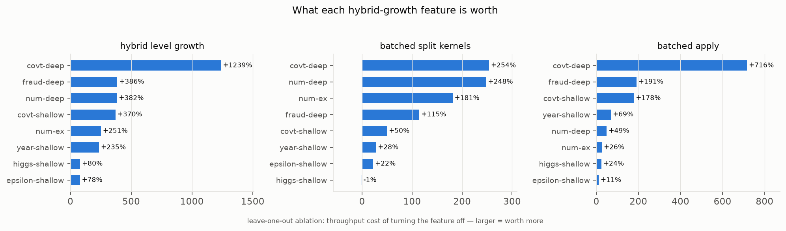

Two sub-features extend the same idea:

- **Batched split kernels (`batch_kernels`)** — one find/sync launch per
  level instead of per pair: +254% covtype-deep, +248% numerai-deep, +181%
  numerai-example, +115% fraud-deep, +28–50% year/covtype-shallow.
- **Batched apply (`batch_apply`)** — the split-application phase batched the
  same way: +716% covtype-deep, +178% covtype-shallow, +191% fraud-deep,
  +69% year, +49% numerai-deep. (The batched path numbers new leaves
  level-wise, the per-split fallback in split order — equivalent trees,
  verified prediction-bit-identical, but different file md5; the ablation
  classifies it as a renumber key.)
- **Selective grow-then-prune (`selective`)** and the **speculative one-sync
  pipeline (`one_sync`)** extend level batching to budget-limited and
  non-quantized configurations; on shapes where they don't apply they cost
  nothing (±2% noise in every cell), which is exactly why they can default on.

  Selective is what keeps the batching exact once the budget *can* bind — the
  case the diagram above explicitly sets aside. A whole level is grown
  speculatively, the candidates are ranked by gain (which is the order leaf-wise
  would have used), and everything past the budget is collapsed again, its leaf
  ids recycled. The `numerai-leaf` regime is exactly this
  shape: 1024 leaves, unbounded depth.

  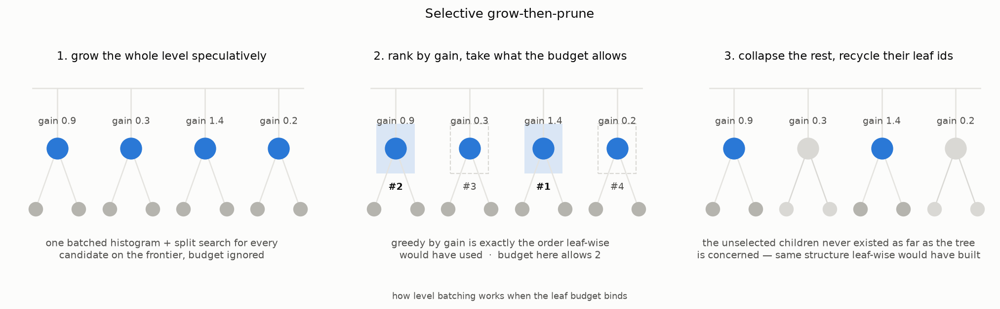

## 2. CUDA-graph level loops (`graph_loop`)

**The problem.** Even batched, each level's launch sequence is issued by the
CPU. For shallow trees the levels are so short that CPU launch overhead
returns.

**The idea.** CUDA lets you record a sequence of kernel launches once (a
"graph") and replay it from the device itself. Falcata captures the per-level
sequence and lets a device-side controller replay it, removing the CPU from
the inner loop entirely.

**Measured (leave-one-out ablation):** nothing clears the noise floor. The
largest readings are +9.3% on covtype-deep and +4.5% on both numerai cells,
against noise bands of 12% and 5% respectively (§7 methodology note) — every
other cell is inside ±2%. The direction is consistently positive on the big
cells, which is what you would expect from a real but small effect, but this
suite cannot resolve it, so no number here is quotable and the section carries
no plot.

The graph's job today is simply smaller than when it landed: the one-sync and
batched flows already removed most of the host round-trips it was built to
hide. It stays on because it is free where it doesn't help, and the planner
picks per shape.

## 3. Per-tree compact column view (`compact_quant`)

**The problem.** With `feature_fraction < 1`, each tree randomly samples a
subset of columns. But the bin matrix is row-major: even if a tree uses 10%
of the columns, reading a row drags the other 90% through the memory system,
because unused columns share the same cache lines.

**The idea.** Once per tree, gather ONLY the sampled columns into a dense
"compact" matrix. Histogram passes then read purely useful bytes. The gather
costs one pass; the histogram kernels run 11+ passes per tree over the
result.

**Measured (leave-one-out ablation):** +249% on numerai-deep, +177% on
numerai-example — the two feature-sampled workloads; neutral elsewhere (it
only activates when sampling is on). The win scales with the excluded
fraction: ~3.4× at `feature_fraction=0.1`, tapering to ~1.1× at 0.6.

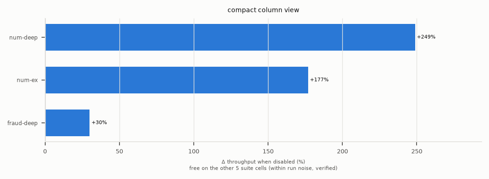

## 4. GPU-native ingestion (`gpu_construct`, `fast_rowdata`, `efb_precheck`, `rowdata_4bit`)

**The problem.** Before training starts, raw features must be binned and laid
out for the GPU. Upstream does this on the CPU, then uploads — minutes of
setup for large datasets (numerai Booster creation was 13.9s even after
earlier fixes; originally far worse).

**The ideas.**
- **`gpu_construct`**: dense binning runs on the device; CuPy /
  `__cuda_array_interface__` inputs never round-trip through host memory.
- **`fast_rowdata`**: build the row-major training matrix directly from
  column bins, skipping the CPU multi-value-bin machinery: +342% on
  numerai-example, +49% epsilon, +39% fraud-deep, +29% year, +24% higgs
  (throughput effect via construct-time inclusion).

  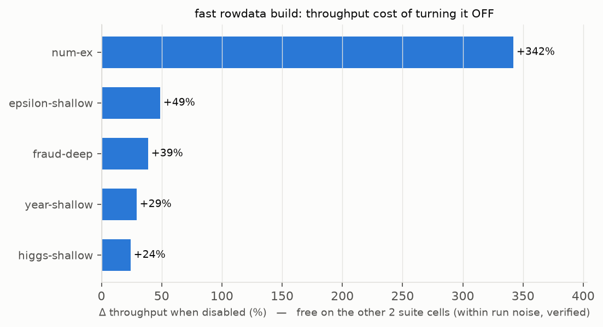
- **`efb_precheck`**: a cheap density check that skips Exclusive Feature
  Bundling's ~7.7s no-op search on provably-unbundlable dense data.
- **`rowdata_4bit`**: datasets whose features all fit 16 bins store two
  values per byte, halving the training matrix (numerai: 19GB → 9.5GB on the
  current cache) and the bytes every kernel reads.

What it buys on the workload ingestion was built for — the numerai matrix,
the largest in the suite (GPU ingestion is a bandwidth play, so this is
where the effect lives; on sub-GB datasets all libraries construct in
under a second and the comparison is noise):

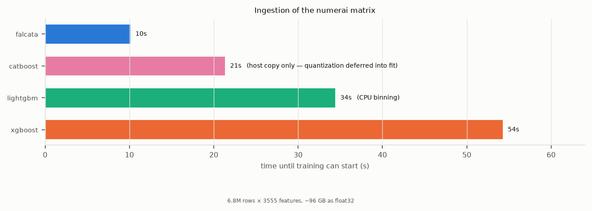

Upstream LightGBM's `Dataset` construction is CPU binning regardless of
training backend — 3.4× slower than our GPU-native construct. Catboost's
low bar is partly an accounting artifact — its Pool build is a host copy,
with quantization deferred into `fit()` where it lands in the train timer.

## 5. Quantized training: `quant_mode` (the speed/quality dial)

**The problem.** Histogram accumulation is the hot loop, and accumulating
double-precision gradient/hessian pairs is memory-heavy.

**The idea.** Quantize gradients to small integers (a published technique —
see the NeurIPS'22 reference in the README) and accumulate integers instead.
Falcata ships two modes: `stochastic` (seeded stochastic rounding — the
aggressive end) and `fixedpoint` (deterministic rounding with an
outlier-robust gradient scale — the near-lossless end). Bin count is the
`quant_bins` dial for both modes (defaults: 4 stochastic, 64 fixedpoint;
any value in [2, 65534]). Both are
bit-reproducible — run to run, across GPU models, and across host
machines: stochastic rounding noise is Philox-generated in-kernel as a pure
function of (seed, tree, row) — an idea borrowed from XGBoost 3.3's Philox
sampling — so machine-independence holds by construction (no tables; also
freed 8 bytes/row of VRAM and their per-tree reads, worth ~+4% on
numerai-deep). Integer atomics make results order-invariant, which is what
lets the md5 regression gates exist and makes them portable to any machine
(cross-arch verified sm_89 vs sm_120 on the table-era build; Philox is pure
integer math and inherits the guarantee).

**Measured (cross-library sweep, numerai-deep regime):**

| mode | train | trees/s | holdout corr | sharpe |
|---|---|---|---|---|
| stochastic | 12.4 min | 40.4 | 0.0238 | 1.407 |
| fixedpoint | 12.7 min | 39.3 | 0.0237 | 1.405 |
| none | 26.1 min | 19.2 | 0.0238 | 1.402 |

2× the speed of full precision at equal quality. The outlier-robust scale is
what makes fixedpoint safe on imbalanced data: without it, fraud/deep AUC
drops 0.9825 → 0.8001. Across every deep cell of the sweep:

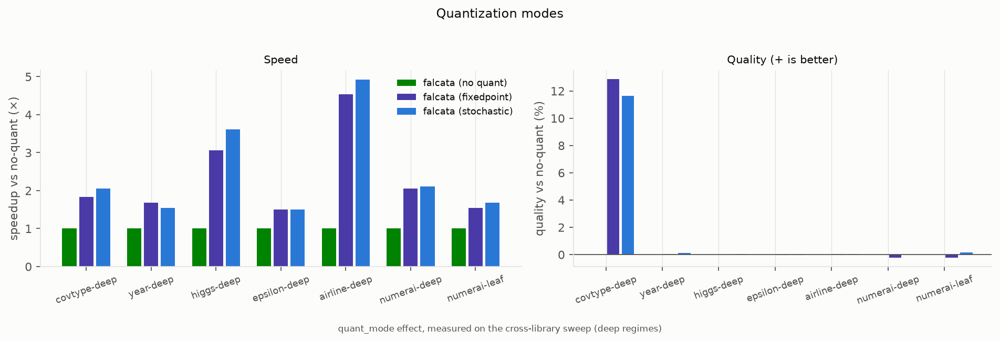

The suite exposed one real stochastic defect, since fixed: at a flat
4-bin auto default, big datasets driving many small leaves
(year/epsilon deep, ~400 rows/leaf) *declined* in test quality
mid-training — the trees were fitting rounding noise (year-deep peaked at
iteration 75, then lost +4.9 MSE). The rounding scheme was innocent
(stochastic@64 exactly matches fixedpoint@64); the resolution was simply
too coarse for small per-leaf sums. The stochastic auto
default therefore raises itself to 64 bins (constant-hessian) / 16 (others) when
`num_data ≥ 100k` and expected rows/leaf < 4096 — measured drift now +0.17
MSE / 0.0000 AUC, at fixedpoint's cost on those shapes and no change
anywhere else. Two deliberate exclusions, both measured: small datasets
keep 4 bins (there the rounding noise is regularization and finer bins
hurt), and ≥50:1-imbalanced binary keeps 4 bins (fraud-deep measured AUC
.956@4 → .870@16 — the no-robust-scale failure mode; use fixedpoint for
imbalanced data, its robust scale is built for exactly this).

Bin count is also bounded above by the int32 histogram guard
(`num_data × bins < 2^31`, the hessian lane is binding): the fixedpoint
*auto* default clamps itself to the dataset-safe ceiling
with a warning (airline's 92M rows → 23 bins) instead of refusing; an
explicitly-set unsafe `quant_bins` still fails loudly rather than silently
wrap.

## 6. Precision modes (`cuda_precision=fp32`)

For NON-quantized training, storing global histograms as float pairs instead
of double pairs halves their bandwidth. Measured per-tree wins at
equal-or-better quality: epsilon-deep −36% time, year −18%, covtype −16%,
fraud-deep −14%, higgs-deep −12%; numerai neutral (sampling-dominated).
Quality-gated rather than bit-identical, hence a config parameter and not a
plan key.

A second, separately-measured mechanism: on DEEP trees the
histogram pool halves from ~248MB (doesn't fit the 5090's 96MB L2) to
~124MB (mostly fits), so subtraction's parent-histogram re-reads start
hitting cache. Isolated on covtype non-quant: fp32 gains **+26% deep** vs
+1.7% shallow — the cache cliff, not bandwidth, dominates the deep win.
Practical guidance: on deep non-quantized configs, `cuda_precision=fp32` is
the single highest-leverage switch available.

## 7. Memory-layout micro-optimizations (each small, all free)

- **`gh_interleave`** — gradient and hessian interleaved as one float2 so a
  row costs one scattered 32-byte read instead of two: +21% numerai-deep.
- **`split_packed_read`** — split kernels read the 4-bit packed matrix
  directly instead of materializing a ~1.5GB per-tree column copy: +12%
  numerai-deep. Sparse-encoded columns are served per column from their own
  materialized buffer (their encoding spells the most-frequent bin as 0, which
  never matches the row matrix); a per-tree fallback here is a trap — with the
  sparse columns concentrated in one EFB bundle, `feature_fraction` 0.15
  samples the bundle on ~99% of trees, which silently un-ships the read
  (measured −27% trees/s on the numerai h60 shape). Guarded by the throughput
  ratio in `tests/gates/sparse_column_view.py`.
- **`batch_reghist`** — for ≤8-bin datasets, accumulate a thread's rows in
  registers and flush once instead of two shared-memory atomics per row.
- **`batch_wide`** — wide-shape batched search for many-column datasets
  (+9.9% on epsilon in the smoke ablation), plus wide leaf-splits init
  batching.
- **`small_leaf_construct`** — a cheaper construct body for very small
  leaves. Extended to quantized training: when a deep level's
  largest sibling pair is under 1024 rows, a dedicated kernel adds packed
  integer gradients straight to the global histogram — the shared-memory
  zero + sync + merge (whose cost is proportional to partition *bins*, not
  rows) is skipped entirely: **+11.2% covtype-deep**, neutral on numerai
  (its 10k-row min-leaf never triggers it). Bit-identical by integer
  order-invariance — unlike the float direct body, which remains permanently
  disabled. Kept as a separate kernel deliberately: an in-kernel branch
  version cost the never-taken numerai path measurable register pressure.

Four more (measured in a dedicated battery; all
bit-identical in every cell):

- **`wide_partitions`** — on datasets wider than 504 columns, each construct
  thread handles two columns, halving the partition count and its per-partition
  zero/merge overhead: **+8.8% numerai-deep**; mechanically inert on narrower
  data.
- **`l2_policy`** — pins the gradient/hessian and data-index buffers into a
  persisting L2 window so each level's bin-matrix stream stops evicting them
  (the construct kernel is latency-bound on exactly those scattered re-reads):
  +2.8% numerai-deep and covtype-deep at the original fixed 64MB carve-out,
  improved to **+5.3%** once the carve-out was sized to the buffer actually
  pinned (device-proportional sizing — a fixed carve
  stranded 42MB of L2 the streaming reads could have used); neutral on year
  at real run lengths. Its companion: bin-matrix loads are marked
  **evict-first** (`__ldcs`) since bin bytes have no intra-level reuse —
  deprioritizing them frees L2 for histogram-subtraction re-reads: +8%
  covtype-deep, +10% year via the dense-path loads, and **+9.7%
  numerai-deep** once extended to the compact-view pack-codec reads (the
  per-tree compact matrix re-reads 11+ passes/level against a 96MB L2 —
  streaming priority stops it evicting the pinned gradient window).
  (Prediction inverted by measurement: the win is largest on the "already
  L2-resident" shapes.)
- **`colmajor_fill`** — a one-time column-major copy of the packed bin matrix
  serves as the compact-fill gather source, so the per-tree fill reads
  contiguous columns instead of dragging ~10× its bytes through row-major
  cache lines: +2.2% numerai-deep. The per-cell fill kernel that reads it moves
  one byte per thread and runs at ~24% of DRAM bandwidth, latency-bound rather
  than bandwidth-bound; `tiled_fill` below is the kernel that uses the
  contiguous columns fully. The copy is as large as the 4-bit row data and
  optional, so it is decided late and against measured memory: before the
  second tree, when everything sized by the data already exists (row data,
  training and validation columns, scores and gradients for every class, the
  partition, the first tree's views and level buffers), it is made only if
  free memory then covers it plus what can still grow — the split finder's
  per-level buffers up to `num_leaves / 2 + 2` pairs, the bit-change scratch,
  the compact view's partition padding, and 256 MiB. Otherwise training keeps
  the row-major source with a warning (same model); `FALCATA_DEBUG=diag` logs
  an engagement. The first tree always fills from the row-major matrix. This
  decision is `colmajor_direct:off`'s (and that of data whose columns cannot
  be uploaded directly); by default there is no copy to decide on.
- **`colmajor_direct`** (with `view_mode`, `view_mask_ff`) — the column-major
  copy above holds, byte for byte, the Dataset's 4-bit columns laid end to
  end, so it is uploaded straight from them and the device keeps **one** copy
  of the bin matrix: no row-major matrix at Init, no host pack, no transpose,
  no memory rule. Which copy depends on the training regime, decided per
  `train()` from `feature_fraction` (again on `update(train_set=...)` and on a
  `feature_fraction` reset):
  - **compact** (`feature_fraction` < `view_mask_ff`, default 0.85): the
    column-major store; every tree fills its compact view of the sampled
    columns from it (`tiled_fill` reads it).
  - **mask** (`feature_fraction` ≥ 0.85, or `compact_quant:off`): one full
    view in the row-major layout, filled once from the columns through a
    256 MiB staging chunk (never the whole store next to it); no tree copies
    anything, and the kernels apply the per-tree sample through the column
    masks they already take (`is_feature_used_bytree`, `bin_used`).

  Against `colmajor_fill`'s decision (numerai53, RTX 5090): the first round
  of every `train()` is **1.85 s shorter** (2.49 → 0.64 s: no 11 GiB host
  pack, upload and transpose), steady state is unchanged (16.4 ms per round
  on numerai53-deep, 8.3 on the example config, identical models), and peak
  device memory drops by **11.3 GiB** at `feature_fraction` 0.1 and 1.0 and by
  10.2 GiB at 0.9 (table below).
  `view_mode:compact|mask` forces a regime; `colmajor_direct:off` restores the
  row-major matrix and `colmajor_fill`'s decision. The threshold is the
  measured crossover below; `feature_fraction_bynode` does not enter (the
  views hold the per-tree sample, the per-node draw happens in the split
  finder either way). Quantized training is bit-identical in every regime
  (the same bytes, and integer histograms for the masked kernels), so the
  regime may change between any two trees without changing the model —
  which is what makes the live choice below legal. Float histograms are not
  order-invariant (the full-matrix kernels group rows by the partition's
  column count), so non-quantized training takes the mask regime only when
  every tree samples every column, and otherwise stays compact, which never
  holds more than `colmajor_direct:off` did. Quantized training outside the
  hybrid level flow (per-node sampling, forced splits, two leaves, ...)
  takes the mask regime at any `feature_fraction`: its per-leaf construct
  reads every column of the row-major layout, so a compact view would serve
  nothing.

  **Live regime choice.** Two rules on top of the threshold, both under
  `view_mode:auto`:
  - *memory:* the compact regime is taken only if its store, its compact view
    (sized from `feature_fraction` and the partitions' packed widths, the
    fill's own arithmetic), the one-byte split view of the sampled columns
    whenever the tree learner will build it (its own predicate: no packed
    split read, i.e. no hybrid flow, categorical features,
    `split_packed_read:off`, forced splits, the aggressive tail) and the
    reserve (the split finder's level output and bit-change
    scratch for `num_leaves / 2 + 2` pairs, the booster's per-row state,
    256 MiB) fit in free device memory at decision time; otherwise mask, with
    a diag line saying why. Deterministic: sizes against `cudaMemGetInfo`.
    Quantized training only (see above).
  - *tuner:* with the tuner running (quantized training; ≥300 rounds under
    auto, or `tuner:on`), a `feature_fraction` in [`view_probe_lo`,
    `view_probe_hi`] = [0.5, 0.95] is measured instead: two warm-up trees,
    five timed trees in the threshold's regime, one untimed tree after the
    switch, five timed trees in the other; the regime with the lower median
    per-tree time is kept and written to the tuner's wisdom
    (`~/.cache/falcata/wisdom.txt`, a `view1:` entry keyed by shape, device
    and `feature_fraction`), so the next `train()` of that shape adopts it
    without probing. The floor and small-leaf knob probes wait for it. A
    regime that does not fit is never probed. Switches happen between trees,
    before the tree's clock starts; each frees the old layout before
    building the new one (store → full view: the staged fill from the
    columns; full view → store: the re-upload).
- **`tiled_fill`** — the 4-bit compact fill stages 128 rows of every byte slot
  in a shared-memory `[row][slot]` tile, reading each source column
  contiguously, then writes each partition's rows as one contiguous run with
  16-byte streaming stores: fill 2.01 → 0.52 ms on the 2.75M-row Numerai train
  set (ff 0.1, 132–133 byte slots), ~91% of DRAM bandwidth, **+10.2%
  numerai-deep**, +19.3% on the 32-leaf numerai example config. The
  host picks it when the source is column-major and at most 256 byte slots are
  sampled; row-major sources and wider samples keep the per-cell kernel.
  Bit-identical (the same bytes).
- **`warp_find`** — the quantized per-level split finder runs one warp per
  (feature, leaf) instead of a 256-thread block. The block kernel spent most
  of its time in block-wide scans, reductions and `__syncthreads` (about 36%
  of stall cycles at barriers), and on numerai every feature has 5 bins, so
  251 of 256 threads held nothing. Each lane now owns 8 scan positions: a
  register prefix sum plus a warp shuffle scan, and a shuffle reduction that
  keeps the lowest-position tie-break. On 255-bin features the remaining cost
  is the fp64 gain math, so an fp32 bound on each threshold's closed-form gain
  skips the fp64 evaluation of thresholds that cannot win or tie. **+6.3%
  numerai-deep, +22.7% year-deep, +18.8% epsilon-shallow** end to end.
  Scope: quantized levels launched from the host (not the CUDA-graph loop)
  with fp64 gains, and only when every task of the dataset is a numerical
  feature of at most 256 bins without zero-as-missing handling. NaN features
  are covered whether or not their most-frequent bin is stored; when bin 0 is
  not (non-negative data), the forward scan rebuilds it from the leaf total
  as the block kernel does. One ineligible feature keeps the whole dataset on
  the block kernel. CUDA only. Bit-identical.
- **`row_batch`** — the batched quantized construct walks a leaf's rows
  through a dependent chain (row index, then the packed gradient and the bin
  byte at that index) and was latency-bound on it: ~92% occupancy but ~20% of
  issue slots busy and 77% of stall cycles waiting on those loads. With one
  column per thread, each thread now loads 8 rows' indices, then all 16
  gradient and bin loads, before their shared atomics, and prefetches the next
  8 indices meanwhile; the flush skips empty bins. **+46.1%
  numerai-deep, +16.9% higgs-deep** at 100 rounds; against the construct JIT
  (300 rounds) +26.1% numerai-deep, +7.7% higgs-deep. Wide partitions (two columns per
  thread) keep the unbatched loop. Under `auto` it also replaces the construct
  JIT on long runs (the JIT body is the unbatched loop); an explicit
  `construct_jit:on` runs the JIT in its place, with a warning. Bit-identical.
- **`tuner`** — a per-tree bandit over behavior-preserving execution knobs,
  best-of-15 timing, re-probe every 3000 trees: +2.1% numerai-deep, +2.7%
  year from the saturation-floor knob alone. Quantized training only —
  integer histograms make the model schedule-invariant, so retuning cannot
  change results. Under `auto` it engages only at ≥300 rounds;
  `cuda_plan=auto,tuner:on` forces it. Extended into the full
  three-tier stack: **tier-0** seeds the candidate sets from the device
  (floor candidates scale with SM count relative to the 5090 they were tuned
  on); **tier-1** runs coordinate descent over two knobs (saturation floor
  with an elastic bracket, and the quant small-leaf row threshold); and
  **tier-3** persists the chosen values per (shape, device) signature to
  `~/.cache/falcata/wisdom.txt` — retrains of the same workload skip the
  ~130-tree probe phase and start at the known-best point (measured: +3% on
  a numerai-deep 300-round retrain, covtype-deep 83.8 → 88.2 t/s), while the
  periodic re-probe still verifies the cached choice against reality. Under
  `colmajor_direct` the tuner also chooses the bin matrix's view regime
  inside [`view_probe_lo`, `view_probe_hi`] (§7, `colmajor_direct`), once per
  shape and `feature_fraction`, before the knob probes; that choice is not
  re-probed. (A
  histogram-pipeline-count knob was considered and rejected: it only affects
  the per-pair fallback path — the batched flow every real workload uses
  runs on a single stream.)

**Device memory model of the 4-bit bin matrix under `colmajor_direct`**
(Numerai v5.3, 6.79M rows × 3,555 features; the matrix is 11.24 GiB in
either layout):

| | layout | lifetime | ff 0.1 | ff 1 |
|---|---|---|---|---|
| store (compact regime) | the Dataset's 4-bit columns, column-major (column c from nibble c × rows, rows rounded up to even) | the training | 11.24 GiB | — |
| compact view (compact regime) | the tree's sampled columns, row-major | refilled from the store every tree | 1.13 GiB | — |
| full view (mask regime) | every column, row-major (the old row-major matrix's bytes and layout) | the training | — | 11.24 GiB |

Peak device memory over idle on numerai53-deep (30 rounds; nvidia-smi
`memory.used`, 500 ms sampling), against `colmajor_fill`'s decision:

| feature_fraction | 0.1 | 0.5 | 0.9 | 1.0 |
|---|---|---|---|---|
| `colmajor_direct:off` (master) | 25.0 GiB: matrix + copy + view | 18.2 GiB: matrix + view (copy declined) | 22.8 GiB: matrix + view (copy declined) | 24.0 GiB: matrix + copy no tree reads |
| `colmajor_direct` (auto) | **13.7 GiB**: store + view (compact) | 18.2 GiB: store + view (compact) | **12.6 GiB**: full view (mask) | **12.6 GiB**: full view (mask) |

A compact-regime reader that needs every column in the row-major layout (a
tree that happens to sample every column, the split view of a pack-codec
tree) gets the full view filled from the store, kept while consecutive trees
read it and released on the first that does not; that is the one case with
two copies, and the default regimes never reach it on numerical data.

**Where the regimes cross.** numerai53-deep, `view_mode:compact` against
`view_mode:mask`, 200 rounds, two interleaved fresh-process pairs per point;
identical model md5 at every `feature_fraction`:

| feature_fraction | 0.1 | 0.2 | 0.35 | 0.5 | 0.7 | 0.8 | 0.85 | 0.9 | 0.99 | 1.0 |
|---|---|---|---|---|---|---|---|---|---|---|
| compact, ms/round | **16.4** | **33.5** | **59.0** | **133.8** | **175.1** | **189.5** | 246.2 | 251.3 | 262.9 | 210.9 |
| mask, ms/round | 177.3 | 185.9 | 218.4 | 220.5 | 222.5 | 224.5 | **224.2** | **224.8** | **223.3** | **210.7** |
| compact, peak GiB over idle | 13.8 | 14.9 | 16.6 | 18.3 | 20.6 | 21.7 | 22.3 | 22.8 | 23.9 | 23.9 |
| mask, peak GiB over idle | 12.7 | 12.9 | 13.0 | 12.7 | 12.7 | 12.7 | 12.7 | 12.7 | 12.7 | 12.7 |

The masked full-matrix kernels read every column of every row, whatever the
sample, so their time barely moves with `feature_fraction`; the compact view
pays a per-tree fill but reads only the sampled bytes. They cross between
0.80 and 0.85, hence `view_mask_ff` 0.85. Under auto there is no step at
0.99 → 1.0 any more (mask 223 → 211 ms); before, 0.99 paid a per-tree copy
of 99% of the matrix that 1.0 did not (263 → 211 ms). At ff 1 the compact
column is the full view next to the store, the same kernels with twice the
memory.

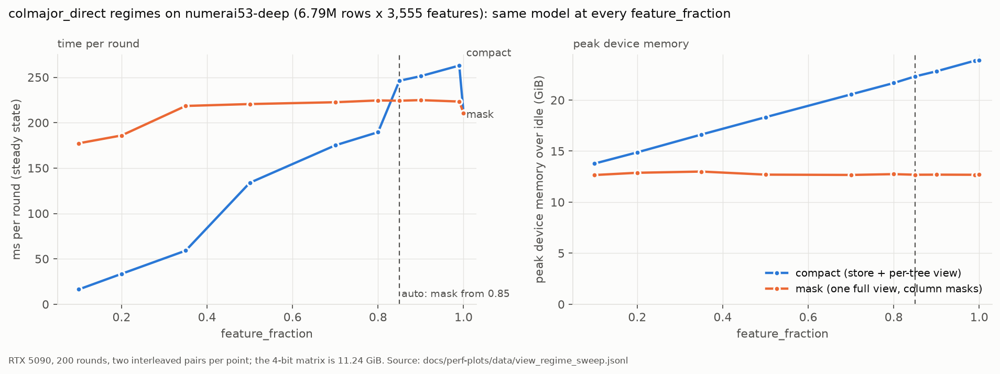

**The live choice on numerai53-deep** (RTX 5090, `tuner:on`, 130 rounds, a
fresh wisdom file per run, two pairs; "static" is the same plan with the
probe band emptied, `view_probe_lo:2`; identical model md5 in every pair):

| feature_fraction | 0.1 | 0.8 | 0.85 | 0.9 | 1.0 |
|---|---|---|---|---|---|
| regime (probe medians, ms/tree) | compact (outside band) | **compact** (157–159 vs 183–184) | **mask** (205 vs 187–191) | **mask** (206–207 vs 187) | mask (outside band) |
| same as the static rule | yes | yes | yes | yes | yes |
| first 130 trees, static → probe | 2.72 → 2.72 s | 21.53 → 22.45 s | 25.30 → 26.16 s | 25.32 → 26.23 s | 23.94 → 23.94 s |
| peak device memory over idle, static / probe | 13.8 / 13.8 GiB | 21.8 / 21.6 GiB | 12.6 / 22.1 GiB | 12.6 / 22.7 GiB | 12.6 / 12.7 GiB |

The probe costs ~0.9 s once per (shape, device, `feature_fraction`): two
regime switches and five trees in the slower regime. A cached decision costs
nothing. On this shape it confirms the threshold. Its memory cost is the
probed regime's own footprint: above the threshold the five compact trees
hold the store plus an 85–90% view (22 GiB); the switch itself never holds
both layouts (a store plus a full view plus that view would not have fit at
all). After the first `train()`, wisdom skips the probe and the peak is the
mask regime's 12.6 GiB.

Against master (300 rounds, default plan, a fresh wisdom file per run, three
pairs, identical models): at `feature_fraction` 0.1 steady state is
unchanged (16.40 vs 16.42 ms per round, n.s.); at 0.9 it is **5.7% faster**
(204.9 → 193.2 ms, CI [11.3, 12.2] ms saved), since master fills a 90%
compact view from its row-major matrix every tree. The first round is 1.8 s
shorter at both.

`wide_partitions`, `l2_policy`, `colmajor_fill` and `tuner` compose: **+10.5% on
numerai-deep combined**. A methodology note the
battery re-taught us: 100-round probe cells on fast datasets (year runs 0.4s)
sit inside clock/thermal noise — the year "regressions" the battery first
reported all vanished under interleaved A/B at 500 rounds.

The ablation shows each of these within noise on shapes they don't target —
the planner's "default on, individually ablatable" contract in action.

**On 6.8M rows the fill and finder paths were off.** `colmajor_fill`,
`tiled_fill` and `warp_find` were measured on smaller Numerai caches. On the
6.79M × 3555 v5.3 training set none of them engaged: the column-major
copy's old Init-time rule wanted 19.1 GiB free (copy + per-tree view +
max(2 GiB, copy / 2)) where a 32 GB card had 17.8 GiB, so every fill read the
row-major matrix with the per-cell kernel; and the warp finder skipped the
dataset because its NaN features (1,972 of 3,555, all non-negative) do not
store bin 0. With the copy decided before the second tree against measured
memory (it engages with 16.3 GiB free: an 11.2 GiB copy plus a 1.2 GiB
reserve, of which training then used 70 MiB) and the finder covering those
features, numerai-deep on that set drops from 29.6 to 18.3 ms per round
(**1.62x**) and numerai-example from 17.0 to 9.0 ms (**1.90x**), identical
models (interleaved fresh-process A/B, 300 rounds, RTX 5090).

## 7b. Runtime-JIT construct kernels (`construct_jit`)

The NVRTC infrastructure (shape-keyed compile cache, AOT fallback,
self-test-then-promote) serves ALL mask-free quantized dense shapes, not just
the compact view. The specialized kernel strips the runtime branches the AOT
kernel must carry (feature/bin masks, graph state, speculative sizing,
wide-partition predication) — on an issue-bound kernel those branches are the
remaining fat. It is bit-identical everywhere; the canonical 700-round locks
reproduce exactly with the JIT live.

**Measured (leave-one-out ablation):** small single-digit effects on the
big cells — numerai-deep sits inside run-to-run noise (consecutive
measurements: +8.4% and +0.3%). The one above-noise reading, fraud-deep
+48%, is a sub-second cell — too swingy to quote as precise (§7 methodology
note), which is also why this section carries no plot: the honest chart
would show a single bar of exactly that number.

The original numerai win required syncing the JIT template with the
evict-first (`__ldcs`) loads first — an unsynced template measured at
parity, which earlier led to a premature dead-end verdict (since
corrected). Its body is the unbatched row loop, so since `row_batch` (§7) it
is off under `auto`; with `row_batch:off` it engages for quantized runs of
≥300 rounds (the ~230ms one-time compile+self-test amortizes).
`construct_jit:on` forces it in place of the row-batched AOT kernel;
unsupported shapes (graph capture, speculative levels, masked trees, wide
partitions) fall back to AOT automatically.

## 8. GPU inference via NVIDIA FIL

`Booster.predict()` on a CUDA-trained model routes through cuML's Forest
Inference Library when available: numerai predict 0.90s → **0.046s** (CuPy
in/out), higgs 0.37s → 0.004s. See the README for precision notes and the
opt-out.

## 8b. Model size: the FALB binary format

**The problem.** The upstream text model format is enormous — a 45k-tree
numerai production model is 471.6 MB of ASCII, and even gzip only takes it
to 148 MB, because numbers-as-text compress poorly and the leaf values are
f64 noise to an entropy coder.

**The idea.** A sectioned binary container: typed
arrays instead of text, zlib-6 per section, a byte-plane shuffle before
compression so the coder sees the near-constant high-order bytes first
(worth ~4 MB alone), and thresholds stored as per-feature dictionaries of
the distinct doubles. zlib over zstd deliberately: it links dynamically
everywhere including rentals, and zstd's ~5–10% edge isn't worth a build
dependency.

**Measured (real production artifact, 45k trees × 3555 features):**

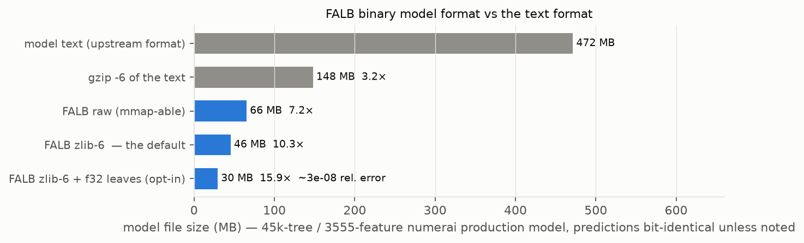

The default is **10.3×** smaller than the text format with **bit-identical
predictions** and a faster load (0.188 s → 0.160 s); gzip-of-text manages
only 3.2×. The remaining lever is the f64 leaf-value array (54.8% of the
raw file, incompressible at 1.15× even shuffled) — hence the opt-in f32
leaves at 15.9× for ~3e-08 relative error, the one knob that trades
exactness. The format reserves `leaf_dim` and dtype tags per array so
vector leaves (multi-target) and new precisions arrive without a v2.

## 9. Categorical features on the hybrid fast paths

Categorical datasets previously fell back to the classic one-split-at-a-time
loop for every hybrid stage, and quantized training refused them outright.
Four pieces lifted the whole class:

- **Batched apply** (1a): variable-length categorical bitsets travel through
  the fixed-size batched split inputs via a per-level side-band INNER-bitset
  arena in the data partition. The arena-build kernel constructs bitsets and
  patches most-frequent-bin default directions on device, removing the
  classic flow's three per-split D2H round trips. Tree recording interleaves
  per-split categorical recording with numerical SplitBatch chunks.
- **Selective (grow-then-prune) flow** (1b): applied-record snapshots of the
  inner threshold bins (the finder's per-leaf slab is recycled before
  finalize) plus a categorical replay branch in RebuildFromHostSplits with
  host-built bitsets. Selective vs classic produces identical structure and
  categorical bitsets (leaf-value fp noise only, same class as numerical).
- **Quantized training** (2a): the categorical search runs its per-bin math
  in double either way, so one reader-templatized body serves both
  pipelines; quantized readers unpack the packed int32/int64 integer bins
  per bin (exact) and the writers fill the packed int64 child totals the
  quantized pipeline seeds child leaves from. fixedpoint-vs-none rmse delta
  at 200k rows with card-3 + card-120 categoricals: 0.198356 vs 0.198346.
- **Batched level kernels** (2b): both level find kernels (non-quantized and
  discretized) run the categorical body per (task, pair, role) block; the
  per-slot categorical-threshold slabs grow with the level output buffer.

Measured (400k rows x (5 numeric + card-3 + card-150 categorical),
63 leaves, 200 rounds, identical rmse and categorical split counts across
all flows):

| flow | train time |
|---|---|
| classic loop | 1.76s |
| hybrid, per-pair fallback (after 1b) | 1.45s |
| hybrid, batched level kernels (after 2b) | **0.48s (3.7x)** |

Still excluded for categoricals: the one-sync speculative prefix and the
graph loop (two-sync batched carries the win); >256-category features use
the 255 most frequent categories per split on the shared-memory finder
(Init warns) because upstream never wrote a global-memory discretized
finder. Open items tracked on the ROADMAP.

---

## 10. Batched-apply partition overhaul: deferred leaf map + flat-grid kernels

Profiling the 92M-row airline-cat deep regime (1023 leaves, depth 10) showed
the level-batched apply's partition kernels at 77% of GPU time -- the
data-partition-memory-bound class first profiled on higgs. Two structural
fixes, both bit-parity (canonical md5 locks reproduce identically):

- **Deferred row->leaf map.** The gen-bit-vector kernel wrote
  `data_index_to_leaf_index` for every row at every level: a 4-byte random
  scatter, one full DRAM sector per row, ~55% of the kernel's traffic at deep
  levels. Every consumer of the map is a tree-end operation, so it is now
  written once per tree by `MaterializeLeafMapKernel` from the final leaf
  windows (the selective flow materializes from the final classic layout,
  replacing its remap).
- **Flat-grid apply kernels.** The 2D `(largest leaf's blocks x num_splits)`
  grid is mostly empty blocks at skewed deep levels (millions per launch).
  Host-launched levels now run a 1D grid-stride loop over the level's real
  chunk count with a binary-searched `(descriptor, local block)` mapping
  (`flat_block_start` prefix in the descriptor). The graph-captured device
  loop keeps the controller-resized 2D form.

Airline-cat, 500 rounds (xgboost native-categorical as reference):

| regime | falcata-noquant | falcata-stoch | xgboost |
|---|---|---|---|
| deep (1023 leaves) | 95.1s -> **47.0s** | 93.4s -> **41.7s** | 43.8s |
| shallow (63 leaves) | 28.7s -> **23.5s** | 26.8s -> **20.5s** | 22.8s |

Per-level partition cost fell from ~17.4ms to ~2.2ms. A second round
removed the next three bottlenecks: the interleaved categorical
recording ran ~6 launches + TWO blocking length readbacks per categorical
split (~432/deep tree -- also the source of +-2.3s run-to-run jitter), now
ONE batched bitset kernel + ONE readback per level; the known-final level
writes the row->leaf map inline in split-inner (with explicit leaf-cache
invalidation for its never-searched children -- the subtle correctness pair
the lattice fingerprints caught) and skips a wasted next-level search; and
the one-sync prefix admits categorical datasets. A third pass replaced the
gen/aggregate byte hand-off with packed ballot bits.

**Official numbers** (FAIR interleaved protocol: quiet
desktop, per regime one warmup round-robin then 3 timed rounds with the four
engines interleaved per round — earlier mixed-condition numbers had up to
+-10% desktop-GPU-contention noise, spreads now 0.0-0.5% shallow / 2.5-9.8%
deep; catboost from the prior pass, not re-run at 925.6s/1838.3s):

| regime | falcata-stoch | falcata-noquant | xgboost | lightgbm CUDA | margin vs best other |
|---|---|---|---|---|---|
| shallow | **18.8s** | 20.4s | 22.6s | 35.4s | **19.8% faster** |
| deep | **33.9s** | 36.7s | 44.8s | 144.6s | **31.9% faster** |

Time-to-quality (report/aircat_time_to_quality.png in the bench workspace;
curve cells + extended falcata runs): falcata-stoch rides the top envelope at
small budgets (shallow @10s: 0.8224 vs xgboost 0.8206 vs lightgbm 0.8072;
deep @33s: 0.8675 vs 0.8661 vs 0.8565) and at large budgets it passes every
competitor's TERMINAL quality -- deep 0.8852 @154s vs lightgbm's 0.8837
there, 0.8873 @210s beyond lightgbm's 0.8863 endpoint; shallow 0.8541 @72s
vs their 0.850/0.845 bests. In a narrow band around xgboost's own endpoint
it is tied-to-slightly-ahead (within ~0.004) before its curve stops. The
upstream-lightgbm AUC outlier at fixed rounds is
its CUDA deviating from its own CPU spec (inflated split gains, first-tree
divergence analysis; our engine matches lightgbm-CPU node for node) -- at
equal wall time the outlier disappears.

## 10b. The Numerai round after the pair-joint construct: occupancy, the tree boundary, level pruning

After the pair-joint construct and the fused root fill, a numerai53 benchmark-split round (5.46M rows, 3,555 4-bit
features, `feature_fraction` 0.1, 1024 leaves at depth 10, `min_data_in_leaf` 10k) was about 6.0 ms: the pair-joint
construct 2.5 ms (40%), the fused fill 1.5 ms (DRAM-bound at ~1.3 TB/s), the small level kernels ~1.3 ms, and
0.7-0.8 ms of GPU idle. A second overnight agentic search took about 9% off that round with eight `cuda_plan` keys,
all default on, each bit-identical (identity keys in `ablation.py`, flip cells in the lattice), none adding device
memory.

**Construct occupancy (`pair_block_rows`, `pair_capped_rows`).** The whole-row construct is latency-bound: 57% of
its stall samples wait on the index -> gradient / packed-byte gather. At 64 registers its block took the
per-partition kernel's 4 rows of the 178-byte interleaved row (712 threads, 23 warps), the only block on its SM.
- `pair_block_rows` sizes the whole-row block by resident warps at the kernel's register count: 5 rows, 28 warps
  (construct -5.6% in nsys).
- `pair_capped_rows` adds a `__maxnreg__(48)` build of the same body with 15 rows in flight (12 for the root's
  direct-read instantiation, both spill-free) and takes it, in 2-row blocks three per SM (36 warps, 34.5 measured),
  where the occupancy API says it keeps strictly more warps resident. Left alone, the driver gave those blocks the
  100 KB shared-memory carveout their tables could use, cutting the gathers' L1 to a quarter and making every
  variant slower; the carveout is now set to the resident blocks' tables (the 64 KB tier), and shapes that would need
  more than 64% of the SM's shared memory keep the default build. Construct -5.6% again. Needs CUDA 12.4.
- Measured and not kept: a 40-register cap (48 warps) spills; `__launch_bounds__(768, 2)` with an 8-row batch (92%
  occupancy) is 4% slower, the same loads in flight with less L1; 1-row blocks are capped at 30 warps by the tables.

**The tree boundary (`async_tree_start`).** About 0.2 ms of the idle sat at the tree start and end: ~13 synchronous
pageable `cudaMemcpy` of KB-scale fill metadata before the fill, a `cudaStreamSynchronize` on the 1.5 ms fill before
the root level was prepared, device syncs between the gradient discretizer's default-stream kernels, the quantized
root-sum readback in `InitValues`, and host waits after the leaf-map pass and the score update. None of these waits
was needed where it stood: the uploads became `cudaMemcpyAsync` on the same legacy default stream (GPU order
unchanged), the fill's readers are ordered by the stream or by the legacy stream's implicit synchronization, the root
sums are read where the level prefix first needs them, and the tree's host copy is read before the leaf-map pass.
Function-local upload sources are copied and kept until the tree end (the CUDA documentation promises a staged
pageable source on return only for `cudaMemcpy`). nsys: GPU idle 715 -> 545 us per round. Off with
`compact_prefill`.

**Level pruning (`skip_unsplittable`, `skip_empty_tail`).** With `min_data_in_leaf` 10k, deep levels hold many leaves
whose `n` rows cannot give both children `min_data_in_leaf` rows; every split-finder count gate needs both, so their
histograms and split searches have no reader. They are no longer constructed or searched (4% of the construct's rows,
16% at depth 9; construct -4.3%). And when the level prefix ends on a complete final level, the leaf-wise tail's
best-of-all-leaves search can only report no split, so it does not run.

**Level apply bookkeeping (`gap_copy_once`, `early_leaf_map`, `leaf_map_small_blocks`).** Leaves that stop early
become terminal index ranges. The batched apply swaps its two index buffers every level, so a range copied into the
out buffer at level k-1 is still in what is the out buffer again at level k: each terminal range is now copied once
(gap copy 64 -> 22 us per round). The residual-leaf map pass goes out with the final level's apply instead of after
the tree end's readbacks, and the map and gap kernels use 256-thread blocks (most of a 1024-thread block had no row).

| step (cumulative) | numerai53 benchmark split, 30k trees | peak device memory |
|---|---|---|
| master (4befcfb2) | 160.2 trees/s | 11,422 MiB |
| + `pair_block_rows` | 166.0 | 11,422 MiB |
| + `pair_capped_rows` | 170.0 | 11,422 MiB |
| + `async_tree_start` | 169.5 | 11,422 MiB |
| + `skip_unsplittable` | 174.6 | 11,422 MiB |
| + `skip_empty_tail`, `gap_copy_once`, `early_leaf_map`, `leaf_map_small_blocks` | 175.6 (1.096x) | 11,422 MiB |

Single 30k-tree runs of the search's candidates (master itself spanned 157-163 trees/s over the session; the
`async_tree_start` step is inside that noise there and measured 1.028x in a same-binary A/B); every run trained the
identical model (holdout corr 0.0239, sharpe 1.40). With the tuner on, 500 rounds timed from round 200 and 6
interleaved fresh-process pairs, the merged keys take a numerai53 benchmark-split round from 5.95 to 5.38 ms
(1.105x [1.099, 1.111]); switching any one key off, or all eight, trains the same model. Of the eight, `async_tree_start`
(+2.7% when off), `pair_capped_rows` (+2.3%) and `skip_unsplittable` (+2.0%) carry most of it; `pair_block_rows`
is inert where the capped build is taken and remains the fallback where it is not. The benchmark's other cells
(`falcata-stoch`, 500 rounds) gain 1.01-1.07x with identical models: covtype 1.05x deep / 1.07x shallow, year
1.04x / 1.04x, fraud 1.05x / 1.06x, higgs 1.02x / 1.01x, epsilon 1.02x / 1.01x.

---

## Multi-GPU: level-batched NCCL all-reduce

The classic data-parallel path all-reduces one leaf histogram per split
(~254 collectives for a 255-leaf tree at ~190us each on 2x3090). Multi-GPU
now rides the hybrid two-sync flow, whose per-level structure allows ONE
grouped collective per level: gather every pair's smaller-leaf histogram
into a contiguous staging buffer (through the colsample-aware used-bin
index when active), reduce once, scatter back, then run the deferred
fix/subtract on the globally reduced histograms.

Measured on a rented dual-GPU box (PCIe, host-staged transport), 4M x 400
int8 `max_bin=5`, 200 trees, `min_data_in_leaf=20k`, depth 11:

| arm | time | trees/s | rmse |
|---|---|---|---|
| 1 GPU (hybrid) | 6.86 s | 29.2 | 0.149124 |
| 2 GPU level-batched | 10.09 s | 19.8 | 0.149141 |
| 2 GPU per-split (classic) | 15.54 s | 12.9 | 0.149138 |

Level batching is **1.54x faster than the per-split reduce** and produces
structurally identical trees to single-GPU (81 leaves, same features and
gains for the first 3 trees; rmse delta is fp32 reduce-order noise). It is
the multi-GPU default wherever the two-sync flow is usable; one-sync,
graph and selective flows remain single-GPU.

Correctness notes for future multi-GPU work: `NCCLTopology` silently
clamps `num_gpu` to the visible device count, so a 2-rank test on a
1-GPU box is a single-rank no-op — multi-rank semantics can only be
tested on real multi-GPU hardware. The canonical count-leak failure
class: struct `num_data_in_leaf` is rank-LOCAL under NCCL, while desc
counts and histogram sums are GLOBAL.
`FALCATA_DEBUG=dump` now prints per-level reduce totals, leaf-cache
entries and bookkeeping counts on NCCL runs — the instrumentation that
located both bugs.

---

## 11. Vector-leaf multi-target trees on the hybrid level prefix

`tree_mode=vector_leaf` trains ONE shared-structure tree per iteration whose
leaves hold a vector of T outputs (`docs/design/vector-leaf-plan.md`). It shipped
on the classic one-split-at-a-time loop; the level-batched prefix now covers it
in the depth-limited regime (`2^max_depth <= num_leaves + 1`), the same regime
plain level batching is leaf-wise-exact in for scalar training.

Three pieces carry T through the level machinery:

- **Per-plane pair descriptors.** A level's descriptor is copied once per
  gradient plane with only the two leaf-splits struct pointers changed, so every
  histogram kernel that takes a descriptor runs per plane unchanged.
- **A batched vector find.** `FindBestSplitsForLevelKernelVector` shares its
  whole body with the per-pair vector finder (one `__device__` inner) and adds
  the scalar level kernel's grid: blockIdx.y = pair, blockIdx.z = smaller/larger.
  The existing level sync reduces it, carrying the per-target payload through
  `CUDASplitInfo::operator=`'s deep copy.
- **A level plane fan-out.** After the batched apply writes each child's primary
  leaf-splits struct, one kernel refreshes all `2 * pairs * T` plane structs from
  it, taking each target's child sums and outputs from the parent split's vector
  payload and offsetting the histogram pointer to plane t.

**The level flow batches the search, not the histograms.** The batched level
construct is what makes plain level batching pay for scalar training, and it is
the one piece vector mode does not take. Per-phase timings (200k x 200,
T=5, 63 leaves, depth 6, ms/tree):

| phase | batched-level construct | per-pair construct |
|---|---|---|
| construct | 110.8 | **68.1** |
| find | 3.1 | 3.1 |
| readback + apply + finish + fan-out | 0.6 | 0.6 |

The batched construct's whole win for scalar is doing one launch with a
saturation floor shared across the level's pairs; with T planes that trades away
the per-leaf sizing and the row working set a pair's T launches share, and costs
more than the launches it saves. So each pair's T planes construct through the
per-pair path back to back, and the level contributes one find, one sync, one
apply and no per-split device syncs.

### What the level prefix and gradient-only planes are worth, together

The prefix and gradient-only histogram planes (§0 of the plan doc) are
independent — one batches the split search over a level's pairs, the other
halves each construct's slot traffic — and they compose almost exactly
multiplicatively. ms/tree, RTX 5090, `num_leaves=63`, `max_depth=6`,
non-quantized fp64, 10 timed rounds after 3 warmup, against the pre-V3 base:

| shape | rows | T | ff | base | +grad-only | +prefix | both | both/base |
|---|---|---|---|---|---|---|---|---|
| 200 cont. features | 200k | 5 | 1.0 | 78.0 | 80.7 | 58.3 | **57.9** | 1.35x |
| 200 cont. features | 200k | 5 | 0.3 | 65.9 | 64.1 | 44.5 | **42.0** | 1.57x |
| 200 cont. features | 700k | 5 | 1.0 | 200.0 | 205.3 | 163.3 | **168.0** | 1.19x |
| 200 cont. features | 700k | 5 | 0.3 | 125.5 | 120.1 | 92.6 | **92.0** | 1.36x |
| 2400 five-valued | 200k | 5 | 1.0 | 189.5 | 130.4 | 163.2 | **111.7** | 1.70x |
| 2400 five-valued | 200k | 5 | 0.3 | 93.9 | 75.7 | 78.9 | **64.7** | 1.45x |
| 2400 five-valued | 700k | 5 | 1.0 | 584.6 | 377.5 | 511.8 | **328.5** | 1.78x |
| 2400 five-valued | 700k | 5 | 0.3 | 261.5 | 204.8 | 223.5 | **171.2** | 1.53x |

T=4 tracks T=5 within a few percent (base/both 1.24–1.70x over the same cells).
The two levers cover disjoint shapes: gradient-only planes are worth 1.23–1.55x
on many low-cardinality features and nothing (0.97–1.04x) on wide continuous
ones, where a bin's gradient and hessian cells share a cache sector and the
second accumulate is free; the level prefix is worth 1.19–1.56x with the larger
share on the wide shape, where the per-split device syncs are a bigger fraction
of a cheap level.

### Against T independent scalar trainings

The decision-relevant ratio is one vector tree against T single-target trees on
the same shape, all on the level prefix. `vector / (T x scalar)`, below 1.0 means
vector wins:

| shape | rows | T=5, ff=1.0 | T=5, ff=0.3 |
|---|---|---|---|
| 200 continuous features | 200k | 2.46 | 1.87 |
| 200 continuous features | 700k | 3.82 | 2.49 |
| 2400 five-valued features | 200k | 0.94 | **0.67** |
| 2400 five-valued features | 700k | 1.34 | **0.83** |

Vector-leaf pays off exactly where the split SEARCH is the expensive phase and
the construct is not: many cheap low-cardinality features, and more so under
feature subsampling, because the shared tree searches the sampled feature set
once for all T targets. On few wide continuous features the construct dominates,
it is paid T times, and T independent scalar trainings win by 1.9–3.8x. This is
a shape decision, not a tuning one.

The T-times-construct term itself is closed: a construct that accumulates all T
planes from one pass over the rows was built and measured, and it LOSES 1.35–3.2x
(plan doc §8a, `docs/perf-dead-ends.md`).

The prefix produces the tree the classic loop produces: on T=2 and T=4 the two
paths' predictions are bit-identical and their leaf labelings are a bijection of
the same row partition (level-batched growth numbers right children in level
order, the per-split loop in best-gain order). Locked by
`test_vector_leaf_cuda_hybrid_level_matches_classic`.

### The selective prefix in the budget-limited regime

Level batching is only leaf-wise-exact while `2^max_depth <= num_leaves + 1`.
The production numerai shape (250 leaves, `max_depth=12`) is not in that regime,
so it took the classic loop; the SELECTIVE (grow-then-prune) prefix now covers
it for vector mode as it does for scalar. Three pieces carry T through it:

- the level's batched search runs on the plane slab, and the plane fan-out runs
  after the level's partition-only apply — the same two calls the exact-fit
  prefix makes;
- selective growth rebuilds the final (pruned) tree host-side, so each applied
  record snapshots its winning split's `kNumVecPayloadFields * T` payload from
  the per-leaf slab under the same reuse discipline as the categorical
  thresholds (one D2H per level, not per split), and `RebuildFromHostSplits`
  replays `SetVectorLeafValuesFromSplitKernel` over it;
- eager collapse recycles leaf indices and their histogram slots; `ZeroHistSlots`
  already zeroes a full T-plane slot, so nothing else changes.

ms/tree, RTX 5090, non-quantized fp64, synthetic 2400 five-valued features,
`num_leaves=250`, `max_depth=12`, 8 timed rounds after 1 warmup (10 at ff=0.1):

| rows | T | ff | vector classic | vector selective | sel/classic | T x scalar | sel/(T scalars) |
|---|---|---|---|---|---|---|---|
| 200k | 4 | 1.0 | 214.6 | 212.2 | 1.01x | 380.0 | **0.56** |
| 200k | 4 | 0.3 | 130.3 | **119.1** | 1.09x | 147.6 | **0.81** |
| 200k | 4 | 0.1 | 89.9 | **81.2** | 1.11x | 90.4 | **0.90** |
| 200k | 5 | 1.0 | 246.8 | 250.9 | 0.98x | 475.0 | **0.53** |
| 200k | 5 | 0.3 | 150.8 | **138.3** | 1.09x | 184.5 | **0.75** |
| 200k | 5 | 0.1 | 98.4 | **94.8** | 1.04x | 113.1 | **0.84** |
| 700k | 4 | 1.0 | 478.0 | 484.1 | 0.99x | 823.7 | **0.59** |
| 700k | 4 | 0.3 | 257.3 | **248.6** | 1.03x | 247.2 | 1.01 |
| 700k | 4 | 0.1 | 157.3 | **144.1** | 1.09x | 165.2 | **0.87** |
| 700k | 5 | 1.0 | 561.8 | 573.6 | 0.98x | 1029.6 | **0.56** |
| 700k | 5 | 0.3 | 300.0 | **289.7** | 1.04x | 309.0 | **0.94** |
| 700k | 5 | 0.1 | 178.7 | **164.2** | 1.09x | 206.5 | **0.80** |

The scalar reference is one single-target training on the same shape, itself on
the selective prefix: 95.0 / 36.9 / 22.6 ms/tree at 200k and 205.9 / 61.8 / 41.3
at 700k for ff 1.0 / 0.3 / 0.1.

**The prefix is worth 1.0x at `feature_fraction=1.0` and 1.03-1.11x under
subsampling — not the ~2x it is worth for scalar training, and that gap is
structural.** The scalar selective prefix's subsampling win comes from the
batched level CONSTRUCT: the per-tree compact-view repack pays off through one
launch per level far better than through the per-split loop. Vector mode does
not take the batched construct (it measured a 0.7x regression with T planes, see
above), so what the prefix buys it is only the batched search, one sync per level
instead of per split, and the level apply. That is a real but small win, and it
is largest exactly where the search is the biggest share: subsampled features.

The equivalence is the same one the exact-fit prefix has: on T=2 and T=4 the
selective and classic vector paths' predictions agree to 1e-9 and their leaf
labelings are a bijection of the same row partition, with a non-vacuity guard
that fails if vector training stops reaching selective growth
(`test_vector_leaf_cuda_selective_matches_classic`). Ground truth against
scalar training comes from
`test_vector_leaf_cuda_selective_duplicated_target_matches_scalar`.

### Quantized vector-leaf training

`quant_mode=fixedpoint` runs one discretized gradient plane per target, each at
its own gradient scale, over plane 0's shared quantized hessians
(`docs/design/vector-leaf-plan.md` §3a). It attacks the term that actually
dominates a vector tree: histogram construct is ~85% of GPU time and is paid T
times, and quantization replaces each plane's 16-byte fp64 (grad, hess) bin with
a 4-byte packed int32 one.

ms/tree, RTX 5090, T=4, 600 five-valued features, `max_bin=15`,
`num_grad_quant_bins=16`, 10 timed rounds after 3 warmup:

| rows | leaves | depth | ff | fp64 | quantized | speedup |
|---|---|---|---|---|---|---|
| 200k | 63 | 6 | 1.0 | 86.3 | **68.2** | 1.26x |
| 200k | 63 | 6 | 0.3 | 72.0 | **66.4** | 1.08x |
| 200k | 255 | 8 | 1.0 | 103.3 | **78.9** | 1.31x |
| 700k | 63 | 6 | 1.0 | 146.9 | **96.6** | 1.52x |
| 700k | 63 | 6 | 0.3 | 108.6 | **102.3** | 1.06x |
| 700k | 255 | 8 | 1.0 | 177.5 | **114.4** | 1.55x |

The win tracks the construct's share exactly: largest (1.5x) at 700k rows and
255 leaves, where construct dominates, and smallest (1.06-1.08x) under
`feature_fraction=0.3`, where the construct is already cheap and the per-plane
launch and find overheads are a bigger fraction of the tree.

Quality is unmoved. Per-target normalized MSE, T=2 and T=4, targets spread over
27x in magnitude:

| targets | fp64 | quantized (16 bins) | quantized (64 bins) |
|---|---|---|---|
| T=2 | 0.0386, 0.0228 | 0.0385, 0.0224 | 0.0391, 0.0226 |
| T=4 | 0.0398, 0.0398, 0.0179, 0.0217 | 0.0402, 0.0406, 0.0183, 0.0220 | 0.0400, 0.0402, 0.0178, 0.0217 |

Every target fits equally well despite the 27x magnitude spread, which is the
per-target gradient scale doing its job — one shared scale would round the
smallest target's gradients to zero. Under bagging (60 rounds, T=4) quantized
lands at 1.02-1.07x of unbagged quantized and 0.98-1.04x of bagged fp64: no sign
of the winner's-curse collapse the discretized find kernels' one-hessian-quantum
l2 ridge guards against.

A separate property, not a performance one: quantized vector models are
**bit-reproducible across execution strategies**. Integer histogram accumulation
is order-invariant, so the batched level prefix and the per-split loop produce
identical predictions to the last bit — where the fp64 vector paths agree only
to ~1e-6 because their batched construct reduces with fp64 atomics.

Quantization is orthogonal to the growth prefix. Both two-sync level flows —
the exact-fit one and the selective grow-then-prune one — reach the planes
through the same `EnqueueLevelHistogramsAndFindVector`, so a quantized
budget-limited config runs quantized selective growth by default, and the model
it produces is the quantized classic loop's to the bit
(`test_vector_leaf_cuda_quantized_selective_matches_classic`, with scalar
quantized training as ground truth in
`test_vector_leaf_cuda_quantized_selective_duplicated_target_matches_scalar`).
